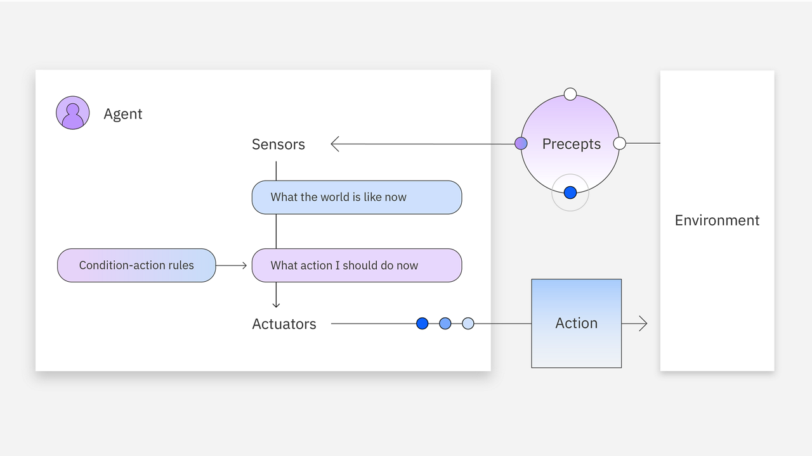
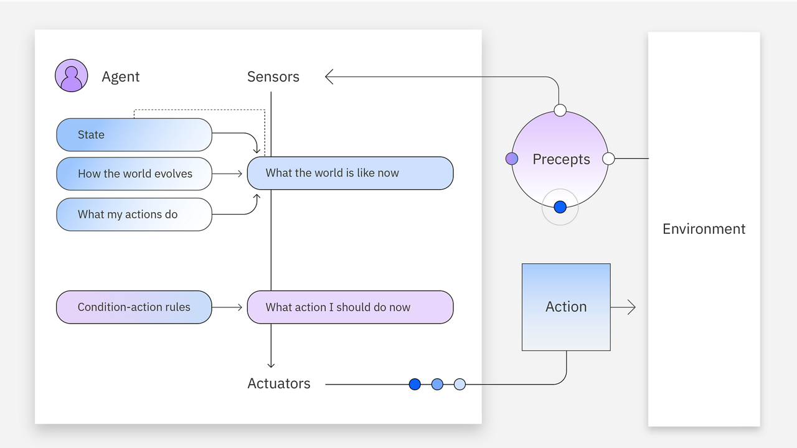
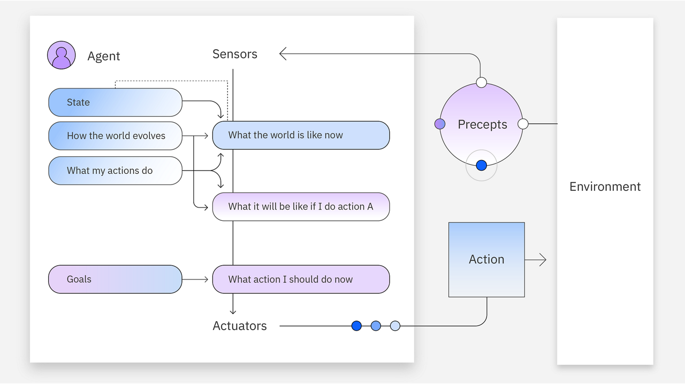
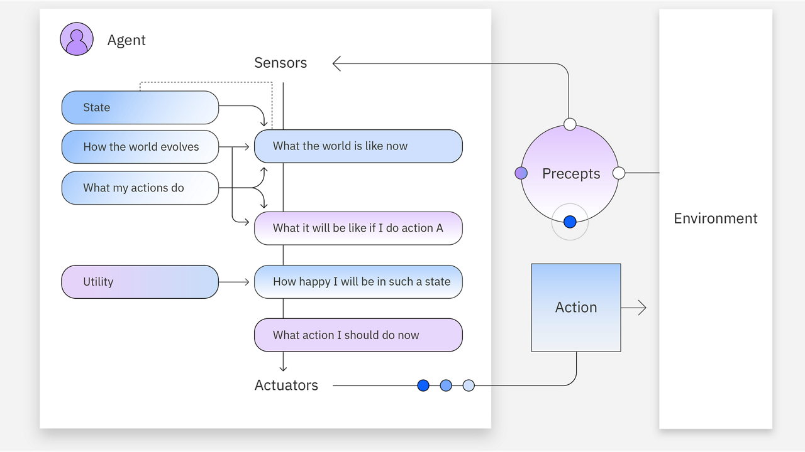
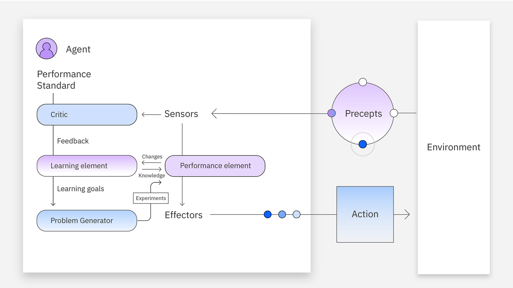

# Types of AI agents

AI agents can be developed to have varying levels of capabilities. A simple agent may be preferred for straightforward goals to limit unnecessary computational complexity. In order of simplest to most advanced, there are 5 main agent types:

## 1. Simple reflex agents

Simple reflex agents are the simplest agent form that **grounds actions on current perception**. This agent **does not hold** any **memory**, **nor** does it **interact with other agents** if it is missing information. These agents **function on a set of** so-called reflexes or **rules**. This means that the agent is **preprogrammed** to perform actions that correspond to certain conditions being met.

If the agent encounters a **situation** that it is **not prepared for**, it **cannot respond appropriately**. The agents are only effective in environments that are fully observable granting access to all necessary information.

**Example**: A thermostat that turns on the heating system at a set time every night. The condition-action rule here is, for instance, if it is 8 PM, then the heating is activated.

Simple reflex agent diagram

## 2. Model-based reflex agents

Model-based reflex agents use both their **current perception** and **memory** to maintain an **internal model of the world**. As the agent continues to receive **new information**, the **model is updated**. The agent’s actions depend on its:

- model,
- reflexes,
- previous precepts and
- current state.

These agents, unlike simple reflex agents, can **store information in memory** and can operate in environments that are partially observable and changing. However, they are still **limited by** their set of **rules**.

**Example**: A robot vacuum cleaner. As it cleans a dirty room, it senses obstacles such as furniture and adjusts around them. The robot also stores a model of the areas it has already cleaned to not get stuck in a loop of repeated cleaning.

Model-based reflex agent diagram

## 3. Goal-based agents

Goal-based agents have an **internal model of the world** and also a goal or **set of goals**. These agents **search for action sequences** that reach their goal and **plan these actions before acting** on them. This **search and planning** improve their effectiveness when compared to simple and model-based reflex agents.

**Example**: A navigation system that recommends the fastest route to your destination. The model considers various routes that reach your destination, or in other words, your goal. In this example, the agent’s condition-action rule states that if a quicker route is found, the agent recommends that one instead.

Goal-based agent diagram

## 4. Utility-based agents

Utility-based agents select the **sequence of actions** that **reach the goal** and also **maximize utility** or reward. Utility is calculated using a **utility function**. This function assigns a **utility value**, a metric measuring the **usefulness of an action** or how “happy” it will make the agent, to each scenario based on a set of **fixed criteria**. 

The criteria can include factors such as: 

- progression toward the goal, 
- time requirements, or 
- computational complexity.

The agent then **selects** the **actions** that **maximize** the expected **utility**. Hence, these agents are useful in cases where **multiple scenarios** achieve a desired goal and an **optimal one must be selected**.

**Example**: A navigation system that recommends the route to your destination that optimizes fuel efficiency and minimizes the time spent in traffic and the cost of tolls. This agent measures utility through this set of criteria to select the most favorable route.

Utility-based agent diagram

## 5. Learning agents

Learning agents hold the same capabilities as the other agent types but are unique in their **ability to learn**. **New experiences** are **added to** their initial **knowledge base**, which occurs **autonomously**. This learning enhances the agent’s **ability to operate in unfamiliar environments**. Learning agents may be utility or goal-based in their reasoning and are comprised of four main elements:

- **Learning**: This improves the agent’s knowledge by learning from the environment through its precepts and sensors.
- **Critic**: This provides feedback to the agent on whether the quality of its responses meets the performance standard.
- **Performance**: This element is responsible for selecting actions upon learning.
- **Problem generator**: This creates various proposals for actions to be taken. 

**Example**: Personalized recommendations on e-commerce sites. These agents track user activity and preferences in their memory. This information is used to recommend certain products and services to the user. The cycle repeats each time new recommendations are made. The user’s activity is continuously stored for learning purposes. In doing so, the agent improves its accuracy over time.

Learning agent diagram