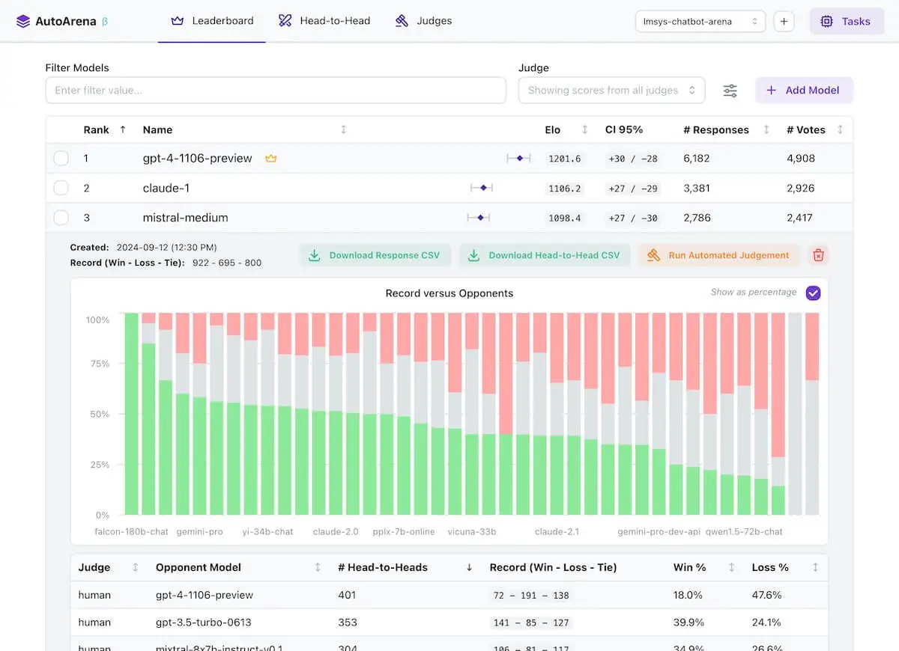
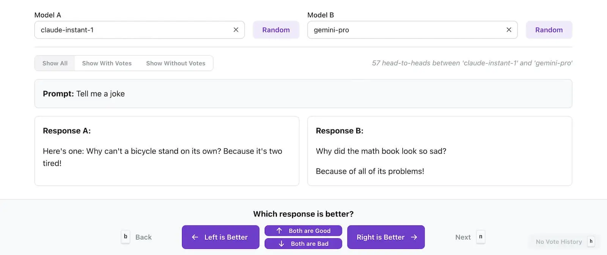
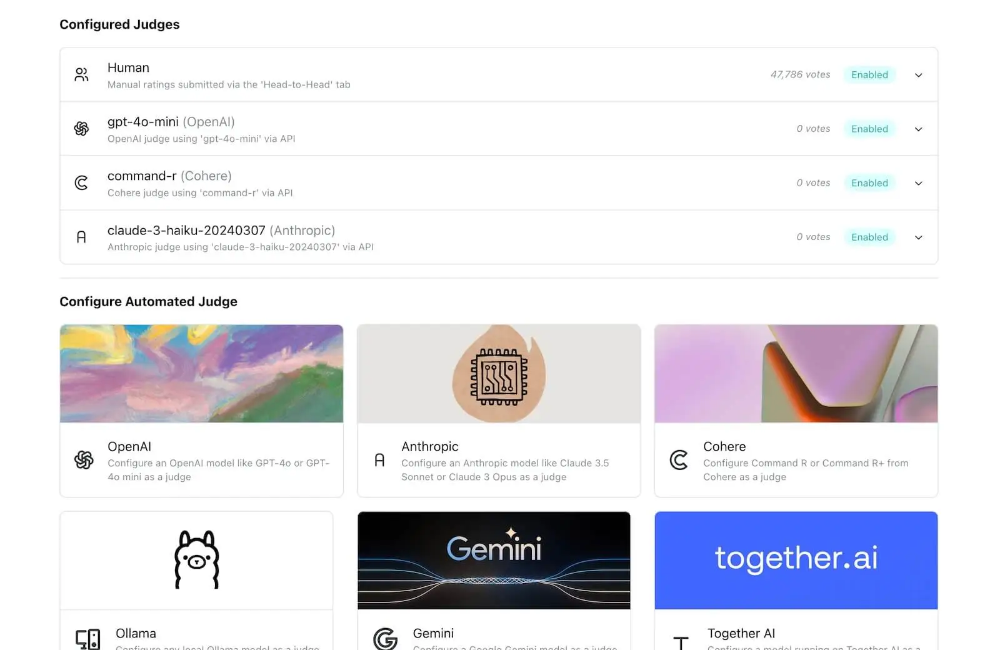
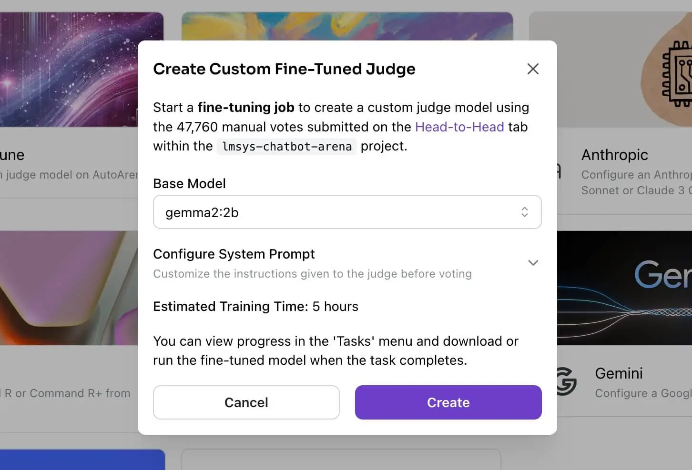
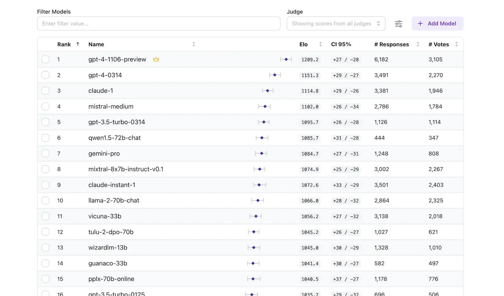
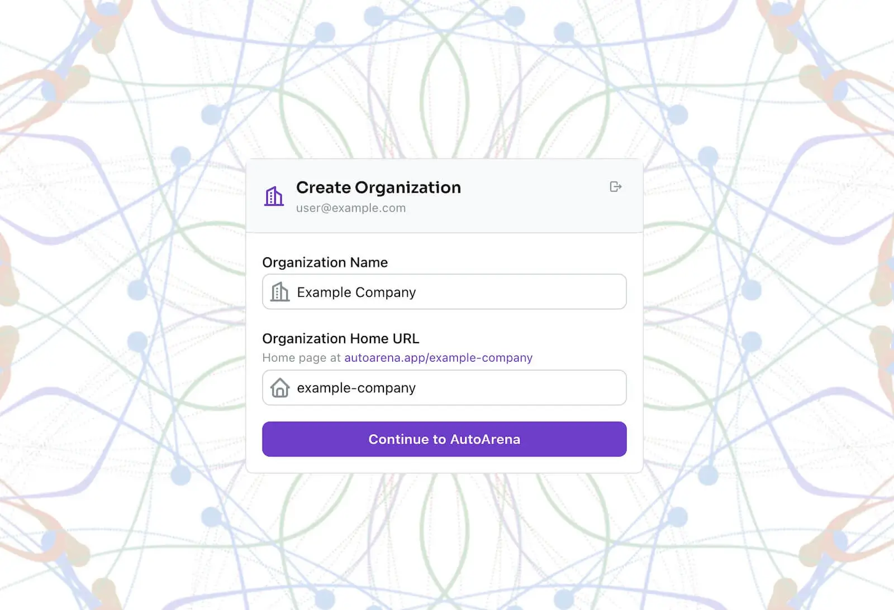

# autoarena

- [autoarena.app](https://www.autoarena.app/)
- [producthunt autoarena](https://www.producthunt.com/posts/autoarena)
- [kolena.com](https://www.kolena.com/)

---

Evaluate LLMs, RAG systems, and generative AI applications using automated head-to-head judgement. Trustworthy evaluation is within reach.

## automated head-to-head evaluation

Testing Generative AI applications doesn't need to hurt
Fast, accurate, cost-effective — automated head-to-head evaluation is a reliable way to find the best version of your system.

Head-to-head evaluation using judge models yields trustworthy results

- **LLM-as-a-judge** is a [proven technique](https://arxiv.org/abs/2306.05685v4) and judge models generally perform better in pairwise comparison than when evaluating single responses
- Use **judge models** from OpenAI, Anthropic, Cohere, Google, Together AI and other proprietary APIs or use open-weights judge models running via **Ollama locally**
- Turn many head-to-head votes into **leaderboard rankings** by computing Elo scores and Confidence Intervals

## "juries" of LLM judges

Use "juries" of LLM judges for a faster, cheaper, and more accurate signal

- Multiple smaller, faster, and cheaper judge models tends to produce a [more reliable signal](https://arxiv.org/abs/2404.18796) than a single frontier model
- Let AutoArena handle parallelization, randomization, correcting bad responses, retrying, rate limiting, and more so that you don't have to
- Reduce evaluation bias by using different judge models from different families like GPT, Command-R, and Claude
- Spend less time and less money on better evaluations

## Fine-tune judge models. Domain-specific evaluations

Fine-tune judge models for more accurate, domain-specific evaluations

- Use the head-to-head voting interface to collect human preferences that can be leveraged for custom judge fine-tuning on autoarena.app
- Achieve >10% accuracy improvements for human preference alignment over frontier models
- Call your fine-tuned judge model via API or download its weights to run it yourself

## Evaluate genAI in CI

- Set up automations in your source code repository to block bad prompt changes, preprocessing or postprocessing updates, or RAG system updates
- Learn how the latest version of your system stacks up against previous versions of your system
- Integrate via a GitHub bot that comments on your pull requests

## Run locally, in the cloud, or on-prem

- Install locally with `pip install autoarena` and start testing in seconds
- Only inputs (user prompts) and outputs (model responses) from your Generative AI system are required for testing
- Collaborate with team members on AutoArena Cloud at [autoarena.app](autoarena.app)
- Dedicated, on-premise deployments on your own infrastructure available for enterprises