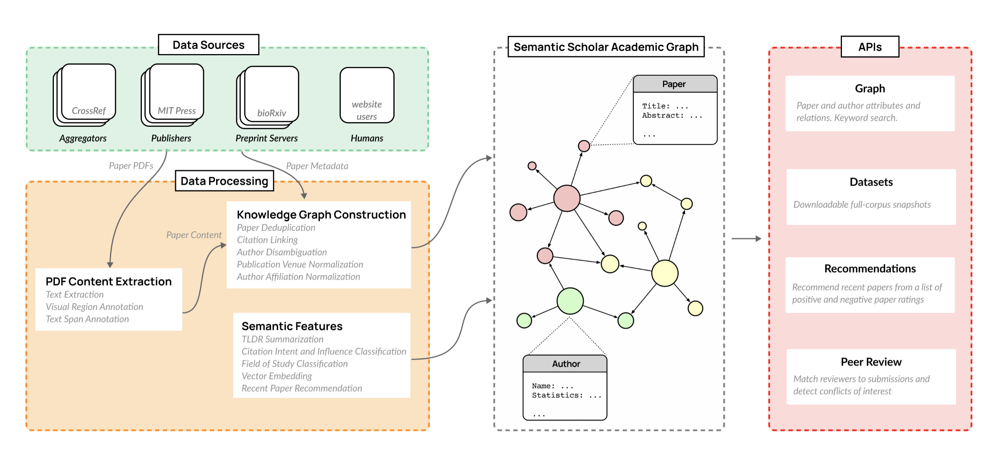

# LLM Data Processing

## Data processing in Dolma

- [ ] Extract useful stuff from [/datasets/dolma](/datasets/dolma)
    - design principles
    - construction
    - contents
    - analyses
    - **data curation practices**
    - **data curation toolkit**
    - **data curation**

## Data annotation in S2ORC

[/datasets/allenai-s2orc-s2ag#s2orc](/datasets/allenai-s2orc-s2ag#s2orc)

Some useful insights about **data annotation** might be derived from [S2ORC: The Semantic Scholar Open Research Corpus](https://www.semanticscholar.org/paper/S2ORC%3A-The-Semantic-Scholar-Open-Research-Corpus-Lo-Wang/5c5751d45e298cea054f32b392c12c61027d2fe7)

- We introduce S2ORC, **a large corpus** of 81.1M English-language academic papers spanning many academic disciplines. The corpus consists of **rich metadata**, paper abstracts, resolved bibliographic references, as well as structured full text for 8.1M open access papers. Full **text is annotated** with automatically-detected **inline mentions of citations, figures, and tables, each linked to their corresponding paper objects**. In S2ORC, we **aggregate papers from hundreds of academic publishers and digital archives into a unified source**, and create the largest publicly-available collection of **machine-readable academic text** to date. We hope **this resource will facilitate research and development of tools and tasks for text mining** over academic text.

## Data Processing in Semantic Scholar

[allenai.org/ai-for-science](https://allenai.org/ai-for-science)

A lof of useful insights for **data processing** could be derived from the paper [The Semantic Scholar Open Data Platform](https://www.semanticscholar.org/paper/The-Semantic-Scholar-Open-Data-Platform-Kinney-Anastasiades/cb92a7f9d9dbcf9145e32fdfa0e70e2a6b828eb1)

This paper combines **public and proprietary data sources** using **state-of-theart techniques for** scholarly **PDF content extraction** and automatic **knowledge graph construction** to build the Semantic Scholar Academic Graph, the largest open scientific literature graph to-date.

The **volume of scientific output** is creating an urgent need for **automated tools** to help scientists **keep up with developments** in their field. Semantic Scholar (S2) is an open data platform and website aimed at accelerating science by **helping scholars discover and understand scientific literature**. We combine public and proprietary data sources using state-of-theart techniques for scholarly **PDF content extraction** and **automatic knowledge graph construction** to build the **Semantic Scholar Academic Graph**, the largest open scientific literature graph to-date, with 200M+ papers, 80M+ authors, 550M+ paper-authorship edges, and 2.4B+ citation edges. The graph includes a**dvanced semantic features** such as **structurally parsed text**, **natural language summaries**, and **vector embeddings**. In this paper, we describe the components of the **S2 data processing pipeline** and the **associated APIs** offered by the platform. We will update this living document to reflect changes as we add new data offerings and improve existing services.

---

- [llm360 github repos](https://github.com/llm360)
    - [amber-data-prep](https://github.com/LLM360/amber-data-prep)
        - Data preparation code for Amber 7B LLM
    - [crystalcoder-data-prep](https://github.com/LLM360/crystalcoder-data-prep)
        - Data preparation code for CrystalCoder 7B LLM
    - [k2-data-prep](https://github.com/LLM360/k2-data-prep)

### Process LLM's training data

- [datatrove](https://github.com/huggingface/datatrove)
    - Freeing data processing from scripting madness by providing a set of platform-agnostic customizable pipeline processing blocks.
    - DataTrove is a library to process, filter and deduplicate text data at a very large scale. It provides a set of prebuilt commonly used processing blocks with a framework to easily add custom functionality.
    - DataTrove processing pipelines are platform-agnostic, running out of the box locally or on a slurm cluster. Its (relatively) low memory usage and multiple step design makes it ideal for large workloads, such as to **process an LLM's training data**.