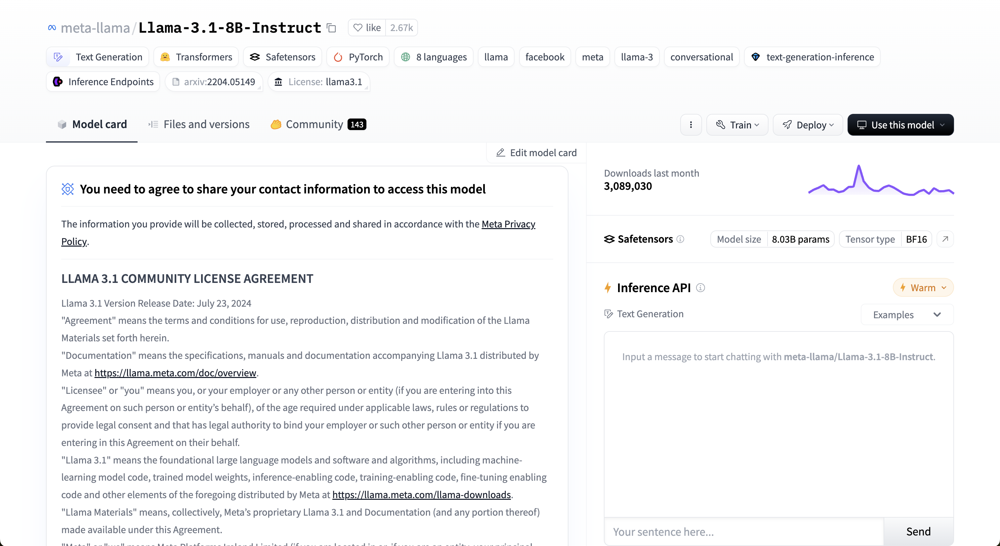
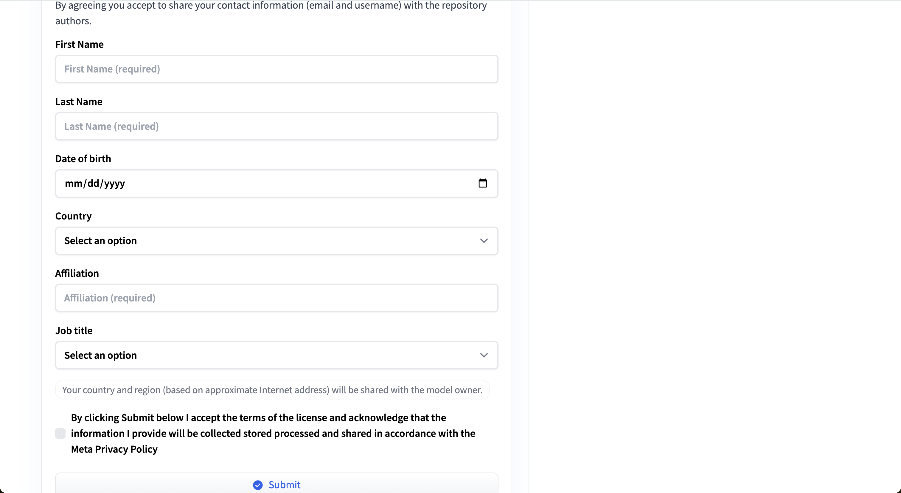

# litgpt

[Lightning-AI/litgpt](https://github.com/Lightning-AI/litgpt) github

[lightning.ai](https://lightning.ai/)

---

## Installation

### Conda

Create python environment

```shell
conda create -n litgpt python=3.11
```

Activate environment

```shell
conda activate litgpt
```

Install litgpt python package

```shell
pip install 'litgpt[all]'
```

---

## Usage

### Download a model

Get the list of all available models

```shell
litgpt download list
```

Filter for specific models

```shell
litgpt download list | grep Llama
```


Download a model 

```shell
litgpt download <modelname>
```

For example

```shell
litgpt download meta-llama/Meta-Llama-3.1-8B-Instruct
```

gives an error (need to specify HF access token):

```shell
litgpt download meta-llama/Meta-Llama-3.1-8B-Instruct

Setting HF_HUB_ENABLE_HF_TRANSFER=1
Traceback (most recent call last):
  File "/Users/cybyrynth/anaconda3/envs/litgpt/bin/litgpt", line 8, in <module>
    sys.exit(main())
             ^^^^^^
  File "/Users/cybyrynth/anaconda3/envs/litgpt/lib/python3.11/site-packages/litgpt/__main__.py", line 71, in main
    CLI(parser_data)
  File "/Users/cybyrynth/anaconda3/envs/litgpt/lib/python3.11/site-packages/jsonargparse/_cli.py", line 119, in CLI
    return _run_component(component, init.get(subcommand))
           ^^^^^^^^^^^^^^^^^^^^^^^^^^^^^^^^^^^^^^^^^^^^^^^
  File "/Users/cybyrynth/anaconda3/envs/litgpt/lib/python3.11/site-packages/jsonargparse/_cli.py", line 204, in _run_component
    return component(**cfg)
           ^^^^^^^^^^^^^^^^
  File "/Users/cybyrynth/anaconda3/envs/litgpt/lib/python3.11/site-packages/litgpt/scripts/download.py", line 85, in download_from_hub
    with gated_repo_catcher(repo_id, access_token):
  File "/Users/cybyrynth/anaconda3/envs/litgpt/lib/python3.11/contextlib.py", line 158, in __exit__
    self.gen.throw(typ, value, traceback)
  File "/Users/cybyrynth/anaconda3/envs/litgpt/lib/python3.11/site-packages/litgpt/scripts/download.py", line 152, in gated_repo_catcher
    raise ValueError(
ValueError: https://huggingface.co/meta-llama/Meta-Llama-3.1-8B-Instruct requires authentication, please set the `HF_TOKEN=your_token` environment variable or pass `--access_token=your_token`. You can find your token by visiting https://huggingface.co/settings/tokens.
```

[huggingface.co/settings/tokens](https://huggingface.co/settings/tokens)

In order to be able to download the llama model, besides providing an HF access token, either with a flag `--access_token=your_token` 
```shell
litgpt download meta-llama/Meta-Llama-3.1-8B-Instruct --access_token=<your-access-token>
```

or env variable `HF_TOKEN=your_token`
```shell
HF_TOKEN=<hf-token>
```

```shell
litgpt download meta-llama/Meta-Llama-3.1-8B-Instruct
```


it is also required to submit a form on the HF page of the llama model:

https://huggingface.co/meta-llama/Llama-3.1-8B-Instruct



...



---

### Download a tokenizer


---

<!-- 


```shell

```

```shell

``` -->