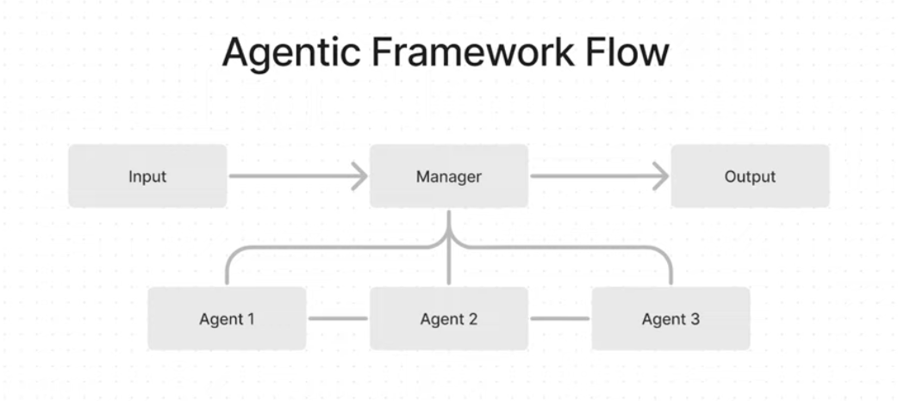

# AI vision

The pace of AI development is such, that it becomes difficult to track all the latest tools, benchmarks and possibilities. It might be a good thing to develop and maintain a vision for AI tools to summarize what the expectations and nice-to-have's of such tools are.

For example, as for code generation, in [claude-engineer](https://github.com/Doriandarko/claude-engineer?tab=readme-ov-file#-features) there is a feature list. Among all points, some are particularly interesting, like:

- **Web search** capabilities using Tavily API for up-to-date information
- Comprehensive **file system operations** (create folders, files, read/write files)
- Interactive **chat interface** with Claude 3 and Claude 3.5 models
- **Image analysis** capabilities with support for drag and drop in the terminal

Some things, like **Web search** are a capability which is quite standard for any LLM (to get up-to date search results from the internet). Or **file system operations**, or broader, ability to understand and execute code in the **context of the entire repo** (regardless of programming language).

- **Web search** is available with [tavily](https://tavily.com/), but it is a paid service. Could probably be an open-source thing, free of any cost and work locally?
- **file system operations**, or better say, **code execution in the repo context** (here I don't mean manually adding files one by one, but executing in the context of the entire repo) is available in tools like [cursor (composer)](https://www.cursor.com/), or [zed](https://zed.dev/)

So, it would be nice to:

1. Break-down all available tools and approaches into corresponding categories, and describe pros-n-cons of using each of those, so that end users have more visibility into those tools and are able to develop AI-adoption roadmaps, depending on which tools better suit their needs, e.g.

   - Code-generation software (for using by humans when writing code)
     - IDEs
     - Plugins
     - terminal programs
     - etc.
   - AI-engineers / AI-Software company
     - AI Personas (like [MGX](https://www.deepwisdom.ai/))

2. Keep it up-to-date and fill with latest data, so that the audience can make the best choice possible and see what the options are.

---

It would be nice to make a comprehensive analysis of all such tools (for the beginning, let's take software development solely) and keep it documented somewhere.

---

## Trends

Since the tools are evolving so rapidly, it might be a good idea to keep an eye on trends and also describe those, the existing ones and also ones that are yet to unfold. So that users and people in general know more of that the upcoming goals and / or possibilities are.

Like as of August 30 2024, having web access for LLMs is a good thing to have, and at some point would be nice to have it as an open-source thing, run locally. But it's not there yet. Having a 360 overview of such things would be nice.

### AI Companies with AI personas

One trend that we can now particularly see, is the upcoming wave AI Companies (enabled with AI personas).

Take [deepwisdom](https://www.deepwisdom.ai/) as an example. First AI Software Company. Same thing probably to happen in all other areas. Herewith a question - is there a sufficient enough need and logic to keep the breakdown of such personas for AI-software (like what crewAI and MoA implement)? If yes, what are these groundings exactly? If not, why? It could be, that when the software was written manually, different tasks and duties were given to different people because of the human-related limitations, or in order to parallelize the work, etc. Are those justifications in place for the AI?

[Why Agent Frameworks Will Fail (and what to use instead)](https://www.youtube.com/watch?v=KY8n96Erp5Q) (spoiler - use Data Pipelines)

Agentic Frameworks flow

Data pipeline flow

---

Agentic frameworks

- [agency-swarm](https://github.com/VRSEN/agency-swarm)
- [crewai](https://www.crewai.com/)
  - [crewAI github](https://github.com/crewAIInc/crewAI)
- [langchain](https://github.com/langchain-ai/langchain)
  - [langgraph](https://langchain-ai.github.io/langgraph/)
- [MetaGPT](https://github.com/geekan/MetaGPT)
- [llamaindex](https://www.llamaindex.ai/)
- [autogen](https://github.com/microsoft/autogen)

---

## Porting Python libs to Node.js 

Is porting some libraries from python to nodejs something of value for the community? Like crew AI, and many other python libs for AI? Does it make sense? Why are those libs written in python? why are there no nodejs version of those? (Metagpt, autogen, etc.)

Herewith some tools like Langchain have it. 