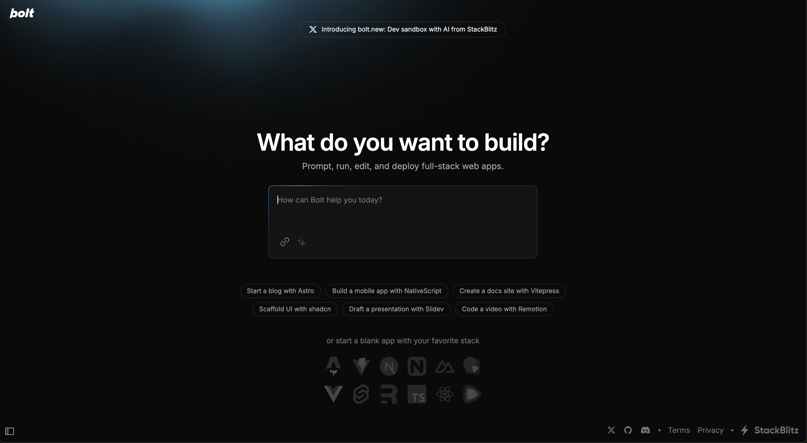

# AI vision

## Releasing AI

Autogenerate **changelogs**, have **build artifacts** for:
- apps / libs
- models / data

Introduce **release-context** for an AI-app, that would have references to everything related to a release, similar to the [ticket-context](/product/features/ticket-system/ticket#ticket-context) or [repo-context](/safe-portal/POCs/Dev/poc-6#61-repo-contextjson).

## DevOps + MLOps CI

In AI age being able to ship reliable software implies that you have to run all OPS (traditional **development operations** for linting, building, testing,  etc. for applications and libraries & **machine learning operations** like training, fine-tuning, evaluating, etc) in an automated way in **CI** as a part of your every-day development / training workflow and for making releases.

## Web-containers & bolt.new

Revolution in AI. bolt.new -like apps will most probably soon take over in every field. Imagine apps with chat with LM on the left-side + web-containerized dev environment on the right side - with an OS and stack of software (Penpot for UI prototyping, Databases and anything else open-source for any kind of work), fully manipulated by LM.

Long story told short.

https://github.com/stackblitz/bolt.new

https://github.com/stackblitz/bolt.new/blob/main/CONTRIBUTING.md

### Similar examples

- [openai canvas](https://openai.com/index/introducing-canvas/)
    
    
- [anthropic artifacts](https://www.anthropic.com/news/artifacts) / [What are Artifacts and how do I use them?](https://support.anthropic.com/en/articles/9487310-what-are-artifacts-and-how-do-i-use-them) / [How we built Artifacts with Claude](https://www.youtube.com/watch?v=vUdNaAAc4FY)
    
- [codesandbox.io](https://codesandbox.io/) (only the code IDE + browser preview)

---

- Extract useful stuff from [safe ai](https://scaledagileframework.com/ai/) like
    - MLOps
    - DataOps
    - etc. (imagine all this scaffolded locally with best practice, guidance, real-time monitoring, etc.)
- https://scaledagileframework.com/introduction-to-artificial-intelligence-ai/
- [ ] **Revisit all new added pages** and add references to all entities relevant to **updated AI Vision**
    - [ ] adopt all the best practices from AllenAI, for evals and everything
    - Understand & extract stuff from video with them
- [ ] add [red teaming](https://www.ibm.com/think/topics/red-teaming) to docs

- [ ] Extract for AI vision:
    - [introducing-openai-o1-preview/](https://openai.com/index/introducing-openai-o1-preview/)
    - [learning-to-reason-with-llms](https://openai.com/index/learning-to-reason-with-llms/) 
    - [openai-o1-system-card](https://openai.com/index/openai-o1-system-card/)

---

Extract & structure data from:

- [Roman Yampolskiy: Dangers of Superintelligent AI](https://youtu.be/NNr6gPelJ3E)
- [LangChain’s Harrison Chase on Building the Orchestration Layer for AI Agents | Training Data](https://youtu.be/6XZLoW0-mPY)

---

