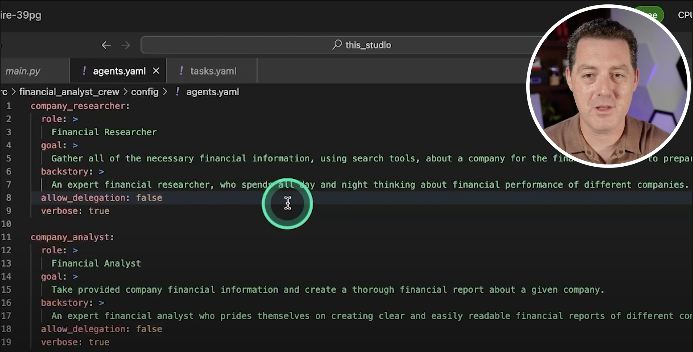
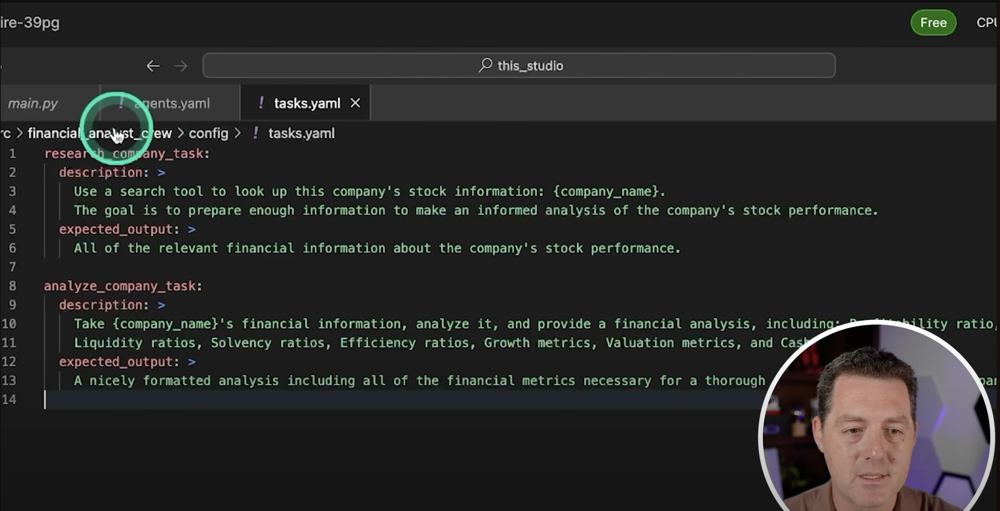

# Agentic Workflows Vision

- [LangChain’s Harrison Chase on Building the Orchestration Layer for AI Agents | Training Data](https://youtu.be/6XZLoW0-mPY)

Agentic workflows requiers specific attention. One huge doubt is that it is a thin layer on top of an LLM. Is there any specific value in the product I'm building, that will not make it obsolete or deprecated with the release of new LLMs like gpt5?

Same question regarding agentic workflows themselves - is there any specific value, that they deliver, that would make it worth of investing time in? If yes, then what exactly?

- [Andrew Ng On AI Agentic Workflows And Their Potential For Driving AI Progress](https://youtu.be/q1XFm21I-VQ)

---

Having clarity on these questions would help find out, if this entire agentic workflow stuff is worth of investing time and effort. (Is building your own LLM a better investment? Is it an alternative at all?)

1. What an agent is?
2. What are the benefits it brings, that would be otherwise unavailable?
3. Are there alternative ways to achieve it? How do they compare?

---

Is an agent just a prompt, that is being sent to an LLM?

Are tasks also just prompts, sent to an LLM?

