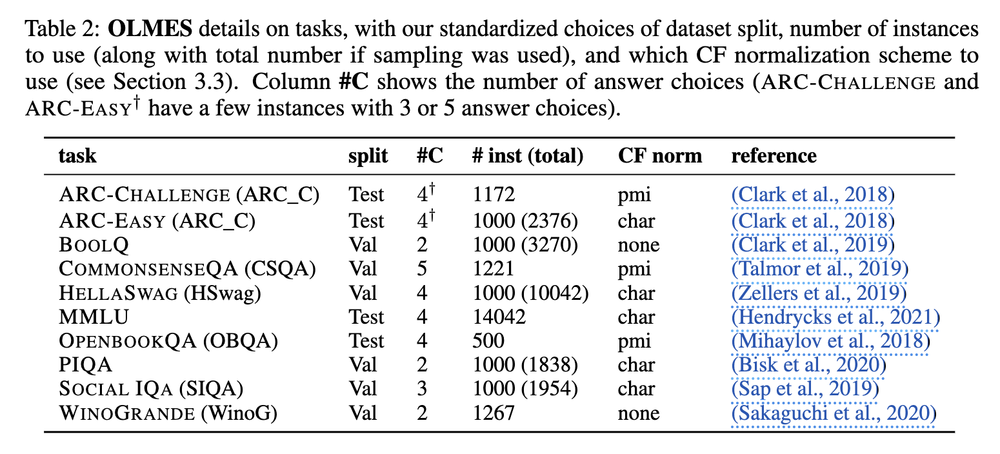

# Evaluation

- TODO:
    - Extract from:
        - [Lessons from the Trenches on Reproducible Evaluation of Language Models](https://www.semanticscholar.org/paper/Lessons-from-the-Trenches-on-Reproducible-of-Models-Biderman-Schoelkopf/dfa0de5cae63eacd675339fc81b13479c51bb153)
        - [Holistic Evaluation of Language Models](https://www.semanticscholar.org/paper/Holistic-Evaluation-of-Language-Models-Liang-Bommasani/ce913026f693101e54d3ab9152e107034d81fce1) (HELM)
        - [Quantifying Language Models' Sensitivity to Spurious Features in Prompt Design or: How I learned to start worrying about prompt formatting](https://www.semanticscholar.org/paper/Quantifying-Language-Models'-Sensitivity-to-in-or%3A-Sclar-Choi/17a6116e5bbd8b87082cbb2e795885567300c483)
        - [Open-LLM-Leaderboard: From Multi-choice to Open-style Questions for LLMs Evaluation, Benchmark, and Arena](https://arxiv.org/abs/2406.07545)
            - https://github.com/VILA-Lab/Open-LLM-Leaderboard
        - [Pythia: A Suite for Analyzing Large Language Models Across Training and Scaling](https://www.semanticscholar.org/paper/Pythia%3A-A-Suite-for-Analyzing-Large-Language-Models-Biderman-Schoelkopf/be55e8ec4213868db08f2c3168ae666001bea4b8)
        - [OLMo: Accelerating the Science of Language Models](https://www.semanticscholar.org/paper/OLMo%3A-Accelerating-the-Science-of-Language-Models-Groeneveld-Beltagy/ac45bbf9940512d9d686cf8cd3a95969bc313570)

---

## Context of the problem

- Comparing one model against reported results of another model is flawed unless **both evaluation setups were exactly same**
- Evaluation results of models are not comparable, if evaluation setups differ (e.g. different formatting)
- The **key goal of comparing models** on
the same downstream task **is to measure** their **relative strengths**
- Some **papers are likely reporting over-estimates of performance** by optimizing the prompt format for their model, while others are not, which is a **community-wide problem** (see [HELM paper](https://arxiv.org/pdf/2211.09110))
    - When evaluating a suite of models using a single
format and comparing against each model’s self-reported result, there are significant differences in performance.

## Context of the solution

- To address [these problems](#context), we present OLMES (Open Language Model Evaluation Standard), **a standard to improve** the **transparency** and **reproducibility** of language model **evaluation** from a
practical point of view, **removing ambiguity** in how a final **performance metric** is obtained when evaluating a model on a dataset.
- OLMES **can be applied** to evaluation **during the model development**
process, leaderboards, papers, providing justified recommendations on
    - data sampling, 
    - how to format instances, 
    - the choice of in-context examples,
    - probability normalization, and 
    - task formulation.
-  OLMES is:
    - **Reproducible**: OLMES specifies all details of the evaluations, so there are **no ambiguities in the evaluation** procedure.
        - from processing datasets 
        - to presenting the task to model
        - to processing models’ outputs
    - **Practical**: OLMES makes practical decisions in use of computation resources for easy adoption by the community.
    - **Documented**: Each decision in the standard is documented with justifications by applying principles from existing studies and performing experiments to investigate open questions.
    - **Open**: We **release all prompts and code**, along with the **rationales behind the choices** made in OLMES, for subsequent work **to** follow and **build upon** by extending the **same principles to any** new task and **model**.

---

## Evaluation Standard. OLMES

- use [olmes](http://localhost:3000/ai-tools/LLM/evaluation/olmes) as [evaluation standard](/ai-tools/LLM/evaluation/olmes#olmes-llm-evaluation-standard-v01) for reproducible LLM evaluations
    - Standardized formatting of dataset instances
    - Curated, few-shot in-context examples for each task (Use fixed, curated 5-shot examples) TBD: [(Section 3.2)]()
    - Evaluate both multiple-choice (MCF) and cloze-form (CF) formulations and use maximum score (Evaluate with both MCF and CF, use the best result) TBD: [(Section 3.4)]()
    - Standardized probability normalization schemes for CF (Use prescribed probability normalization for CF) TBD: [(Section 3.3)]()
    - Prescribed implementations details:
        - Sampling of 1000 instances for each task if more than 1500
        - Use test split if labels are available, otherwise use validation split (Use test set when available, otherwise validation.)
        - For MMLU use macro average over tasks
        - Restrict to maximum 2048 tokens per input
    - Use standardized lists of tasks (for each LM may vary based on domain), e.g.:
        - ARC-Challenge
        - ARC-Easy
        - BoolQ
        - CommonsenseQA
        - HellaSwag
        - MMLU
        - OpenBookQA
        - PIQA
        - Social IQa
        - WinoGrande
    - Use specified, exact prompt format [page 8](https://www.semanticscholar.org/reader/c689c37c5367abe4790bff402c1d54944ae73b2a), TBD: [(Section 3.1)]()
    - Follow recommendations for all other evaluation details (in [Appendix A](#appendix-a))

### Appendix A

A OLMES: implementation details
There are other important details that go into a fully specified evaluation result, and we enumerate the
choices made in OLMES here:
- For MMLU: use macro average (over 57 tasks) rather than micro average (over 14042 instances), following AI@Meta (2024). This better represents the diversity of fields in the dataset, although in practice it does not generally make a big difference (see Figure 7).
- When a model requires it, make sure to add the appropriate <bos> token at start of prompt (e.g., Gemma (Gemma Team et al., 2024)).
- When using the “character” normalization for CF, include the leading space in the calculation of answer length.
- Restrict all inputs (with completions) to 2048 tokens for consistency across models9
- Use the default model precision when evaluating (i.e., avoid options like load_in_8bit unless it produces identical results)
- OLMES uses the standard approach of two newlines to separate each in-context example.
- Other than the original instruction line for MMLU Hendrycks et al. (2021), we do not add any extra instructions. This is in view of previous work finding the subject information from instructions makes little changes to model ranking (Alzahrani et al., 2024), and to reduce additional sources of variation in the prompt.

Note that computational details, like batch size and type/state of GPU, can affect floating point operations such that answer choice decisions can flip if they are very close. This is hard to avoid unless consider “ties” when answers are sufficiently close in confidence.

## Evaluation approach

- set **Scientific credibility for all LLMs** I use, based on reproducible comparisons between models, **as a mandatory default**
    - if a model cannot be reproducibly compared, I shouldn't use it
- evaluate LMs on a **set of specific tasks** (?)
    - when choosing which LM to use, I should probably **prefer models** capable of performing tasks they were **specifically trained on**
    - when considering models (both generalist and specific) to be used in the product, their capabilities should be evaluated with tasks (based on domain of application)
- to ensure **consistency** and **reproducibility** of models evaluation, use **standard** (documented) ways for deciding on choices:
    - **how the task is presented** to the model
        - **prompt formatting**
        - **in-context examples**
        - **normalization techniques**
        - **task formulation**
    - **how** the model **outputs are interpreted** before scoring
    - choices should be reported with **enough information to actually reproduce**
- **considerations** about using or not using a new / another LM **should be based on comparison against reported results**
    - **for newer version of LMs** against previous versions
    - **for alternative LMs** - against latest versions of currently used LM (or other LMs)


## Setup

**scoring** - whether the correct answer is chosen out of the given options

**MCQA (Multiple Choice Question Answering)** is a task where a model (or person) is given a question and several answer options, and it must choose the correct one from those options.

**Completion Formulation** - This is a task where an LLM is **given the beginning of a sentence or passage**, and it must **generate a coherent continuation based on the context**. This type of task is commonly used in applications like autocompletion or predictive text generation.

**Cloze Formulation** - This is a task where **specific parts of the sentence** (often a word or phrase) **are hidden**, and the model must **fill in the missing part**. It is named after the "cloze test" in linguistics, where participants fill in blanks in sentences to test language comprehension.

---

- **MCQA**
    - use **Multiple-choice QA** (question answering) (**MCQA**) due to:
        - the ease of scoring
        - flexibility in the domain
        - flexibility in the complexity of the questions
    the next token
    - use two ways to formulate **tasks** in MCQA
        - **MCF (Multiple-choice formulation)**
            - present answer choices indicated by labels and score prediction of answer labels (just like how MCQA is posed to humans). Example:
                ```
                Question: Earth’s core is primarily composed of which of the following materials?

                (A) basalt (B) iron (C) magma (D) quartz

                Answer: (B)
                ```
        - **CF (Completion/cloze formulation)**
            - score each answer choice separately using LM token probabilities.
            - MCF format is not compatible with the pure language modeling nature of generating the next token. It was possible to elicit much better performance [using a “cloze”
            completion](https://www.semanticscholar.org/reader/90abbc2cf38462b954ae1b772fac9532e2ccd8b0) version of the task, where the model is shown a prompt like:
                ```
                Question: Earth’s core is primarily composed of which of the following materials?
                Answer: <answer>, where each answer choice is separately substituted in for <answer>.
                ```
            - use LM probability of the answer choice tokens to rank the choices and predict an answer. 
            - This formulation has natural limitations, such as not being able to properly address cases where one answer choice is “none of the above”.
- **Targeted tasks**
    - select and implement standards for benchmark MCQA tasks
        - example: We select and implement standards for 10 popular benchmark MCQA tasks. The list covers tasks that are frequently used in the community’s evaluation practices, such as
the Hugging Face Open LLM Leaderboard (Beeching et al., 2023), Llama papers (Touvron et al., 2023a,b; AI@Meta, 2024), HELM (Liang et al., 2023), and the OLMo evaluation suite (Groeneveld et al., 2024). This selection includes **questions** on **science**, various types of **commonsense**, **factual
knowledge**, and covers a **range of topics** (MMLU alone covers 57 subjects), of **varying difficulty**.

            | task                   | reference |
            | ---------------------- | ------- |
            | ARC-CHALLENGE (ARC_C)  | [Think you have Solved Question Answering? Try ARC, the AI2 Reasoning Challenge](https://www.semanticscholar.org/paper/Think-you-have-Solved-Question-Answering-Try-ARC%2C-Clark-Cowhey/88bb0a28bb58d847183ec505dda89b63771bb495) |
            | ARC-EASY (ARC_C)       | [Think you have Solved Question Answering? Try ARC, the AI2 Reasoning Challenge](https://www.semanticscholar.org/paper/Think-you-have-Solved-Question-Answering-Try-ARC%2C-Clark-Cowhey/88bb0a28bb58d847183ec505dda89b63771bb495) |
            | BOOLQ                  | [BoolQ: Exploring the Surprising Difficulty of Natural Yes/No Questions](https://www.semanticscholar.org/paper/BoolQ%3A-Exploring-the-Surprising-Difficulty-of-Yes-Clark-Lee/9770fff7379a7ab9006b48939462354dda9a2053) |
            | COMMONSENSEQA (CSQA)   | [CommonsenseQA: A Question Answering Challenge Targeting Commonsense Knowledge](https://www.semanticscholar.org/paper/CommonsenseQA%3A-A-Question-Answering-Challenge-Talmor-Herzig/c21a4d70d83e0f6eb2a9e1c41d034842dd561e47) |
            | HELLASWAG (HSwag)      | [HellaSwag: Can a Machine Really Finish Your Sentence?](https://www.semanticscholar.org/paper/HellaSwag%3A-Can-a-Machine-Really-Finish-Your-Zellers-Holtzman/8b0f27bb594b1eaaf493eaf1e2ee723a2b0a19ad) |
            | MMLU                   | [Measuring Massive Multitask Language Understanding](https://www.semanticscholar.org/paper/Measuring-Massive-Multitask-Language-Understanding-Hendrycks-Burns/814a4f680b9ba6baba23b93499f4b48af1a27678) |
            | OPENBOOKQA (OBQA)      | [Can a Suit of Armor Conduct Electricity? A New Dataset for Open Book Question Answering](https://www.semanticscholar.org/paper/Can-a-Suit-of-Armor-Conduct-Electricity-A-New-for-Mihaylov-Clark/1536e8958697c5364f68b2e2448905dbbeb3a0ca) |
            | PIQA                   | [PIQA: Reasoning about Physical Commonsense in Natural Language](https://www.semanticscholar.org/paper/PIQA%3A-Reasoning-about-Physical-Commonsense-in-Bisk-Zellers/04f4e55e14150b7c48b0287ba77c7443df76ed45) |
            | SOCIAL IQA (SIQA)      | [SocialIQA: Commonsense Reasoning about Social Interactions](https://arxiv.org/abs/1904.09728) |
            | WINOGRANDE (WinoG)     | [An Adversarial Winograd Schema Challenge at Scale](https://www.semanticscholar.org/paper/An-Adversarial-Winograd-Schema-Challenge-at-Scale-Sakaguchi-Bras/92e121c6e114fe3cfb89370df03847c66a9b4e28) |
- **Selection of models**
    - provide an **evaluation standard that suits a range of model capabilities**, with the flexibility to apply
the same methodology during model development as well as when comparing final powerful models
        - example: We develop OLMES based on a selection of **15 diverse**, openly available pretrained **LLMs**, covering a
range of sizes from 1B to 70B:
            - Pythia-1B, 
            - Pythia-6.7B (Biderman et al., 2023), 
            - OLMo-1B, 
            - OLMo-7B, 
            - OLMo-1.7-7B (Groeneveld et al., 2024), 
            - TinyLlama-1.1B (Zhang et al., 2024), 
            - StableLM2-1.6B (Bellagente et al., 2024), 
            - RPJ-INCITE-7B (Together Computer, 2023), 
            - MPT-7b (MosaicML, 2023),
            - Falcon-7B (Almazrouei et al., 2023), 
            - Llama2-7B, Llama2-13B (Touvron et al., 2023b), 
            - Mistral-7B-v0.1 (Jiang et al., 2023), 
            - Llama3-8B, Llama3-70B (AI@Meta, 2024)

---

It makes sense to develop **own domain-specific evaluation standard** (based on OLMES and it principles) specific to the project (e.g. for SAFe it could be software engineering, Agility, UX, UI Design, Testing, etc). 

This standard might include:
- **project-specific MCQA** with MCF and CF, 
- **project-specific targeted tasks** and 
- **project-specific** selection of **models**.

## Standardize variations in evaluation

When evaluating a model on a dataset, to get a final accuracy metric of a given model on a given dataset a variety of decisions that have to be made:

- [How to format dataset instances?](#how-to-format-dataset-instances)
- [Which few-shot examples to use?](#which-few-shot-examples-to-use)
- [How to normalize LLM probabilities for CF?](#how-to-normalize-llm-probabilities-for-cf)
- [What task formulation to use, MCF or CF?](#what-task-formulation-to-use-mcf-or-cf)
- [Other implementation choices impacting results](#other-implementation-choices-impacting-results)

### How to format dataset instances?

Each MCQA dataset includes a set of fields used to specify an instance, such as question, answer choices, and perhaps a context for the question. When formatting an instance as a prompt to an LLM, many different choices have been made in the literature. This includes simple choices like:
- `"Question:"` vs `"Q:"` as question prefix (varying even within a paper, e.g., Brown et al. (2020)), 
- or formatting the answer labels 
    - (e.g., `"A."` (Touvron et al., 2023a), 
    - `"(A)"` (Nori et al., 2023), 
    - `"<mc>A</mc>"` (Anthropic, 2024),
    - etc). 
- There is also a choice of whether or not to provide a general instruction (e.g., common for MMLU (Hendrycks et al., 2021), sometimes done for OPENBOOKQA (Almazrouei et al., 2023)).

#### Instance formatting

Use **consistent prefix and suffix** in formatting of the dataset instances. 

This clarifies the question-answering task in a natural way, without
relying on verbose instruction understanding. 

- Example: 
    - OLMES uses a consistent `"Question: <question>"` prefix and `"Answer:"` suffix in formatting the datasets.
- Exceptions: 
    - For PIQA, we use `"Goal: <goal>"` as the prefix instead to be consistent with the original semantics of the dataset
    -  In the case of MCF, for HELLASWAG, we skip the question prefix and instead add `"Choose the best continuation:"` before presenting the continuation options
    - for WINOGRANDE we use the prefix `"Fill in the blank:"` to align with the task
    - For HELLASWAG and WINOGRANDE, where the CF answer string is simply a language continuation, we **remove such prefixes and suffixes** for the CF evaluation so that the task is closer to pure language modeling.

#### MCQA label choice

**Example**: For MCF answer choices, OLMES uses the canonical letters `A/B/C/. . .` as answer labels, presenting the multiple-choice options after simple letter labels, i.e., `" A."` format. We note that most tokenizers treat a letter at the start of a line (or string) as a separate token from the same letter following a space. Therefore we add a prefix space in front of each answer label `"\n A. <choice>"` (rather than `"\nA. <choice>"`), to work naturally with all current tokenizers (so that the final answer token will be identical to the answer choice token, see Appendix C.3 for details). All the exact OLMES prompt formats are listed in Appendix G.


##### Appendix C.3 Tokenization of MCQA choice labels

When formatting multiple-choice questions, OLMES specifies the use of a prefix space in front of each answer choice, that is `"\n A. <choice>"` rather than `"\nA. <choice>"`. Figure 3 shows explicit examples of tokenizers where this helps maintain a correspondence between the token for the answer label and the token in the final answer (e.g., `"\nAnswer: A"`). E.g., for the Llama tokenizer, the consistent token is then (`"_A"`) rather than the separate token (`"A"`) you get without the prefix space.

Figure 3: Tokenizer example, showing two examples of tokenizers which need a prefix space before MCQA answer choice labels to represent the choice label and the final answer label using the same token.

```python
> from transformers import AutoTokenizer
> llama_tokenizer = AutoTokenizer.from_pretrained("meta-llama/Llama-2-7b-hf")
> olmo_tokenizer = AutoTokenizer.from_pretrained("allenai/OLMo-1.7-7B-hf")
> test_string = "What is 3+4?\n A. 7\nA. 7\nAnswer: A"
> llama_tokenizer.tokenizer(test_string)
[’_What’, ’_is’, ’_’, ’3’, ’+’, ’4’, ’?’, ’<0x0A>’, ’_A’, ’.’, ’_’, ’7’, ’<0x0A>’, ’A’, ’.’, ’_’, ’7’, ’<0x0A>’, ’Answer’, ’:’, ’_A’] >
olmo_tokenizer.tokenizer(test_string)
[’What’, ’ ̇Gis’, ’ ̇G3’, ’+’, ’4’, ’?’, ’ ̇C’, ’ ̇GA’, ’.’, ’ ̇G7’, ’ ̇C’, ’A’, ’.’, ’ ̇G7’, ’ ̇C’, ’Answer’, ’:’, ’ ̇GA’]
```

##### Appendix G OLMES prompt formats for each task

In Figure 5 we show an example of a **full 5-shot prompt** from **ARC-CHALLENGE (CF)**. Then we show single instance formatting for each of the 10 tasks in Figures 6- 25. For each task, we show both the MCF and CF formats.

All curated few-shot examples and prompt formatting code are available by accessing https: //allenai.org/data/olmes.

---
Figure 5: **OLMES 5-shot prompt example** for ARC-CHALLENGE (**CF**).

- Prompt
    ```
    Question: George wants to warm his hands quickly by rubbing them.
    Which skin surface will produce the most heat?
    Answer: dry palms
    ```
    ```
    Question: Which of the following statements best explains why magnets
    usually stick to a refrigerator door?
    Answer: The refrigerator door contains iron.
    ```
    ```
    Question: A fold observed in layers of sedimentary rock most likely
    resulted from the
    Answer: converging of crustal plates.
    ```
    ```
    Question: Which of these do scientists offer as the most recent
    explanation as to why many plants and animals died out at the end
    of the Mesozoic era?
    Answer: impact of an asteroid created dust that blocked the sunlight
    ```
    ```
    Question: Which of the following is a trait that a dog does NOT
    inherit from its parents?
    Answer: the size of its appetite
    ```
    ```
    Question: A boat is acted on by a river current flowing north and
    by wind blowing on its sails. The boat travels northeast. In which
    direction is the wind most likely applying force to the sails of the
    boat?
    Answer:
    ```
- Completion
    ```
    east
    ```
---

Figure 6: **OLMES prompt example** for ARC-CHALLENGE (**MCF**).

- Prompt
    ```
    Question: George wants to warm his hands quickly by rubbing them.
    Which skin surface will produce the most heat?
    A. dry palms
    B. wet palms
    C. palms covered with oil
    D. palms covered with lotion
    Answer:
    ```
- Completion
    ```
    A
    ```
---

Figure 7: **OLMES prompt example** for ARC-CHALLENGE (**CF**).

- Prompt
    ```
    Question: George wants to warm his hands quickly by rubbing them.
    Which skin surface will produce the most heat?
    Answer:
    ```
- Completion
    ```
    dry palms
    ```
---

Figure 8: **OLMES prompt example** for ARC-EASY (**MCF**).

- Prompt
    ```
    Question: Lichens are symbiotic organisms made of green algae and
    fungi. What do the green algae supply to the fungi in this symbiotic
    relationship?
    A. carbon dioxide
    B. food
    C. protection
    D. water
    Answer:
    ```
- Completion
    ```
    B
    ```
---

Figure 9: **OLMES prompt example** for ARC-EASY (**CF**).

- Prompt
    ```
    Question: Lichens are symbiotic organisms made of green algae and
    fungi. What do the green algae supply to the fungi in this symbiotic
    relationship?
    Answer:
    ```
- Completion
    ```
    food
    ```
---

Figure 10: **OLMES prompt example** for BOOLQ (**MCF**).

- Prompt
    ```
    Persian language – Persian, also known by its endonym Farsi, is one
    of the Western Iranian languages within the Indo-Iranian branch of
    the Indo-European language family. It is primarily spoken in Iran,
    Afghanistan (officially known as Dari since 1958), and Tajikistan
    (officially known as Tajiki since the Soviet era), and some other
    regions which historically were Persianate societies and considered
    part of Greater Iran. It is written in the Persian alphabet, a
    modified variant of the Arabic script, which itself evolved from
    the Aramaic alphabet.
    Question: do iran and afghanistan speak the same language?
    A. yes
    B. no
    Answer:
    ```
- Completion
    ```
    A
    ```
---

Figure 11: **OLMES prompt example** for BOOLQ (**CF**).

- Prompt
    ```
    Persian language – Persian, also known by its endonym Farsi, is one
    of the Western Iranian languages within the Indo-Iranian branch of
    the Indo-European language family. It is primarily spoken in Iran,
    Afghanistan (officially known as Dari since 1958), and Tajikistan
    (officially known as Tajiki since the Soviet era), and some other
    regions which historically were Persianate societies and considered
    part of Greater Iran. It is written in the Persian alphabet, a
    modified variant of the Arabic script, which itself evolved from
    the Aramaic alphabet.
    Question: do iran and afghanistan speak the same language?
    Answer:
    ```
- Completion
    ```
    yes
    ```
---

Figure 12: **OLMES prompt example** for COMMONSENSEQA (**MCF**).

- Prompt
    ```
    Question: Sammy wanted to go to where the people were. Where might he
    go?
    A. race track
    B. populated areas
    C. the desert
    D. apartment
    E. roadblock
    Answer:
    ```
- Completion
    ```
    B
    ```
---

Figure 13: **OLMES prompt example** for COMMONSENSEQA (**CF**).

- Prompt
    ```
    Question: Sammy wanted to go to where the people were. Where might he
    go?
    Answer:
    ```
- Completion
    ```
    populated areas
    ```
---

Figure 14: **OLMES prompt example** for HELLASWAG (**MCF**).

- Prompt
    ```
    Health: How to cope with suicidal thoughts. Put off any plans.
    Promise yourself that you’ll wait 48 hours before doing anything.
    Remember, thoughts don’t have the power to force you to act.
    Choose the best continuation:
    A. Even when you do, there may be a small image of the future still
    lurking around your brain. For instance, don’t tell yourself that you
    can’t make it.
    B. You’re doing something, and no one can force you to act. It’s
    completely natural to feel negative thoughts before you act.
    C. Do not panic if people talk to you (even if it’s about quitting
    smoking). Have a plan for how you’re going to react to a group of
    people who bring on suicidal thoughts.
    D. Sometimes extreme pain can distort our perception. Waiting before
    taking action will give your mind time to clear.
    Answer:
    ```
- Completion
    ```
    D
    ```
---

Figure 15: OLMES prompt example for HELLASWAG (CF).

- Prompt
    ```
    Health: How to cope with suicidal thoughts. Put off any plans.
    Promise yourself that you’ll wait 48 hours before doing anything.
    Remember, thoughts don’t have the power to force you to act.
    ```
- Completion
    ```
    Sometimes extreme pain can distort our perception. Waiting before
    taking action will give your mind time to clear.
    ```

---

Figure 16: OLMES prompt example for MMLU (abstract_algebra) (MCF).

- Instruction
    ```
    The following are multiple choice questions (with answers) about
    abstract algebra.
    ```
- Prompt
    ```
    Question: Find all c in Z_3 such that Z_3[x]/(x^2 + c) is a field.
    A. 0
    B. 1
    C. 2
    D. 3
    Answer:
    ```
- Completion
    ```
    B
    ```
---

Figure 17: **OLMES prompt example** for MMLU (abstract_algebra) (**CF**).

- Instruction
    ```
    The following are multiple choice questions (with answers) about
    abstract algebra.
    ```
- Prompt
    ```
    Question: Find all c in Z_3 such that Z_3[x]/(x^2 + c) is a field.
    Answer:
    ```
- Completion
    ```
    1
    ```
---

Figure 18: **OLMES prompt example** for OPENBOOKQA (**MCF**).

- Prompt
    ```
    Question: When standing miles away from Mount Rushmore
    A. the mountains seem very close
    B. the mountains are boring
    C. the mountains look the same as from up close
    D. the mountains seem smaller than in photographs
    Answer:
    ```
- Completion
    ```
    D
    ```
---

Figure 19: **OLMES prompt example** for OPENBOOKQA (**CF**).

- Prompt
    ```
    Question: When standing miles away from Mount Rushmore
    Answer:
    ```
- Completion
    ```
    the mountains seem smaller than in photographs
    ```
---

Figure 22: **OLMES prompt example** for SOCIAL IQA (**MCF**).

- Prompt
    ```
    Question: Cameron decided to have a barbecue and gathered her friends
    together. How would Others feel as a result?
    A. like attending
    B. like staying home
    C. a good friend to have
    Answer:
    ```
- Completion
    ```
    A
    ```
---

Figure 23: **OLMES prompt example** for SOCIAL IQA (**CF**).

- Prompt
    ```
    Question: Cameron decided to have a barbecue and gathered her friends
    together. How would Others feel as a result?
    Answer:
    ```
- Completion
    ```
    like attending
    ```
---

Figure 24: **OLMES prompt example** for WINOGRANDE (**MCF**).

- Prompt 1
    ```
    Fill in the blank: John moved the couch from the garage to the
    backyard to create space. The ___ is small.
    A. garage
    B. backyard
    Answer:
    ```
- Completion
    ```
    A
    ```
---

Figure 25: **OLMES prompt example** for WINOGRANDE (**CF**). In this case the completions are the same for each answer choice, but the prompt is different.

- Prompt 1
    ```
    John moved the couch from the garage to the backyard to create space.
    The garage
    ```
- Prompt 2
    ```
    John moved the couch from the garage to the backyard to create space.
    The backyard
    ```
- Completion
    ```
    is small.
    ```
---

#### Sampling

**Use the [test split](/glossary#test-split) of a dataset if the labels are publicly available**, otherwise the **[validation split](/glossary#validation-split)**. (Would be nice to get more data about data sampling for easier understanding with examples).

**Example**: OLMES uses the test split of a dataset if the labels are publicly available, otherwise the validation split. If the dataset has more than 1500 instances, we sample 1000 instances to evaluate on, similar to HELM (Liang et al., 2023) which caps evaluation instances at 1000. Note that the potential extra statistical signal from more instances would generally be dominated by other sources of score variations, like prompt formatting, so this is a practical consideration to avoid unnecessary computation resources.



### Which few-shot examples to use?

**Pprovide examples of the task to the model** through few-shot examples, as this is an effective and universal way to convey a task to an LLM.

- Context:
    - Popularized by Brown et al. (2020), it is customary to provide examples of the task to the model through **few-shot examples**, as this is an effective and universal way to convey a task to an LLM. For example, the **MMLU** task (Hendrycks et al., 2021) originally came with a fixed **5-shot prompt** which is generally used in evaluation (Beeching et al., 2023; Gemma Team et al., 2024; Jiang et al., 2023; Touvron et al., 2023b; AI@Meta, 2024) resulting in a more reproducible results than many other tasks. For other tasks, both the number of shots and the way in which they are sampled have varied in different evaluation setups. For example, to evaluate on **HELLASWAG**, Beeching et al. (2023) **sampled 10-shot** whereas **HELM** Liang et al. (2023) **uses 0-shot**; within Beeching et al. (2023), a range of **25-shot**, **10-shot**, **5-shot** was sampled for ARC-CHALLENGE, HELLASWAG and WINOGRANDE respectively.

- Example:
    - **OLMES standardizes a manually curated 5-shots prompt for each task** (from its training set), ensuring that the **examples are of good quality** and **cover the label space in a balanced way** (e.g., avoiding 4 A’s and 1 B among the 5 answers). Restricting to 5 in-context examples helps **limit computational overhead**, similar to HELM (Liang et al., 2023). Analysis suggests that going beyond 5 shots generally does not provide meaningful differences in scores (Brown et al., 2020; Barton, 2024). These manually curated shots for each task can be downloaded from https://allenai.org/data/olmes.

### How to normalize LLM probabilities for CF?

When using the cloze/completion formulation (CF) for multiple-choice questions, the LLM returns `P(ai|q)` to denote the probability for an answer choice ai given a question prompt q. Ranking solely based on the probability may heavily favor shorter answers with fewer tokens. To work around this issue, different [**normalization**](/glossary#normalization) methods have been used in the literature, which we categorize below:

- **none**: ln(P (ai|q))
- **token**: ln(P (ai|q))/ num_tokens(ai), which normalizes the log-probability by the number of tokens in the answer (Brown et al., 2020)
- **character**: ln(P (ai|q))/ num_characters(ai), which normalizes the log-probability by the number of characters in the answer, used by Llama models (Touvron et al., 2023a) and Eleuther AI LM Harness (Gao et al., 2023; Biderman et al., 2024).
- **pmi** (pointwise-mutual-information): ln(P (ai|q)/P (ai|u)) where u ="Answer:" is the unconditional prompt, which normalizes by dividing by LLM probability of the same answer string without the presence of the question (like "Answer: <answer_string>"). This can be considered a form of **pointwise-mutual-information (PMI)** and was explored further in other works (Holtzman et al., 2021).

#### Context:

Efforts like Liang et al. (2023); Gao et al. (2023); Biderman et al. (2024) compare and support comparisons of different normalization approaches, leaving it an open question as to how to make a decision. See Appendix C.2 for further discussions around different normalizations.

To choose a normalization scheme in OLMES, we evaluate the models on each dataset using CF, comparing the effect of the 4 normalization techniques. Table 3 shows for each task, how often each normalization is empirically the best across the 15 models. Detailed scores per model are in Appendix C.2.

OLMES specifies the **“pmi”** normalization for ARC-CHALLENGE, COMMONSENSEQA, and OPENBOOKQA. The answer choices in these datasets tend to contain unexpected words or phrases that are less likely for models to generate (e.g., “Whirlpool bath” compared to “Bathtub”). The pmi normalization adjusts for this by taking into account the a priori likelihood of the answers. This is consistent with other findings (Holtzman et al., 2021) and some existing evaluation practices, e.g., Brown et al. (2020) selectively uses this normalization for ARC and OPENBOOKQA, and Touvron et al. (2023a,b) for OPENBOOKQA. Computing the extra unconditional likelihood incurs some computation overhead, thus OLMES avoids this normalization for other datasets where there is no strong empirical or theoretical reason to choose this approach.

OLMES specifies the **“character”** normalization for ARC-EASY, HELLASWAG, PIQA, SOCIAL IQA and MMLU. Based on our experiments, it is empirically the normalization technique that gives the best scores for these datasets, and less computationally expensive than the “pmi” normalization. It also has the advantage (unlike the “token” normalization) of already being implemented (as acc_norm) in the Eleuther LM Evaluation Harness, where it is generally available for multiple-choice tasks (Gao et al., 2023; Gao, 2021). It is also used in the Hugging Face Open LLM Leaderboard (Beeching et al., 2023) for ARC-CHALLENGE and HELLASWAG, in Touvron et al. (2023a,b)’s evaluations as the default, (with select datasets as exceptions), as well as reported in various works like Biderman et al. (2023); Almazrouei et al. (2023).

OLMES specifies the **“none”** normalization for BOOLQ and WINOGRANDE. In BOOLQ the only answer choices are “yes” or “no” which are single tokens, therefore no length normalization is needed. Note that for some models, the “character” normalization has slightly better performance on BOOLQ (see Table 9), an accidental side effect of “yes” having one more character than “no”. One could argue that the pmi normalization is appropriate as it counters any existing bias in the model for “yes” vs “no”, but we argue that models should be capable of producing such common words (also indicated in the 5-shot examples) without any such corrections. Finally, WINOGRANDE is a special case in that the continuations are identical (and the prompts vary), so the choice of normalization does not matter and we simply use the **“none”** normalization.

In general, we observe little difference between the OLMES recommendation and the empirically
best (“oracle”) normalization for each task and model, see “diff best” column in Table 3 (Table 8 in
Appendix C.2 has more details).

### What task formulation to use, MCF or CF?

Use both the **MCF** and **CF** formulations, and use
the best performing one.

#### Example

In OLMES, we standardize to evaluate each model using both the MCF and CF formulations, and the best performing one is used. This allows for meaningful comparison of task evaluation numbers over a range of models, from the smaller, weaker base models which can only deal with the CF (where MCF scores hovering around random baseline), to the stronger models which can report more
accurate performance using the MCF (where CF provides less clear signal).

## Summary

- Use test set when available, otherwise validation. Sample 1000 instances if more than 1500
- Use specified, exact prompt format (Section 3.1)
- Use fixed, curated 5-shot examples (Section 3.2)
- Use prescribed probability normalization for CF (Section 3.3)
- Evaluate with both MCF and CF, use the best result (Section 3.4)
- Follow recommendations for all other evaluation details (in Appendix A)
