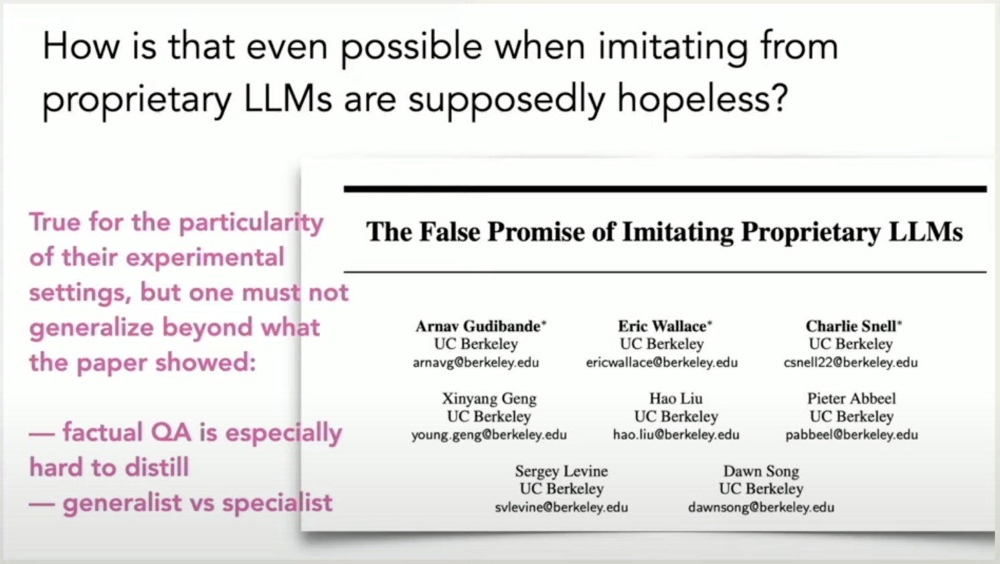
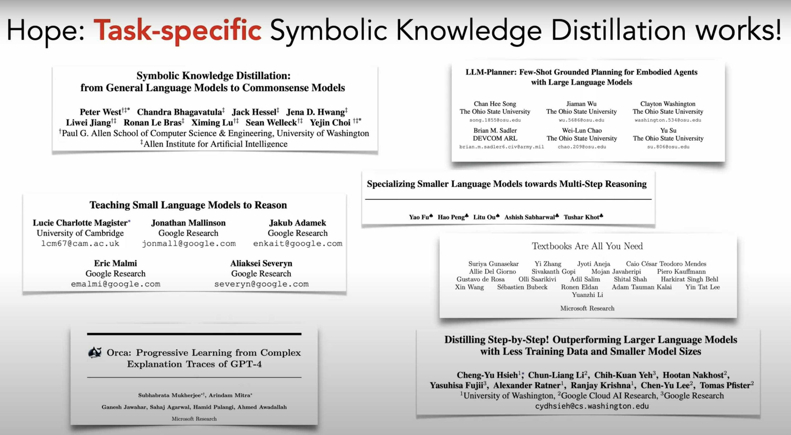
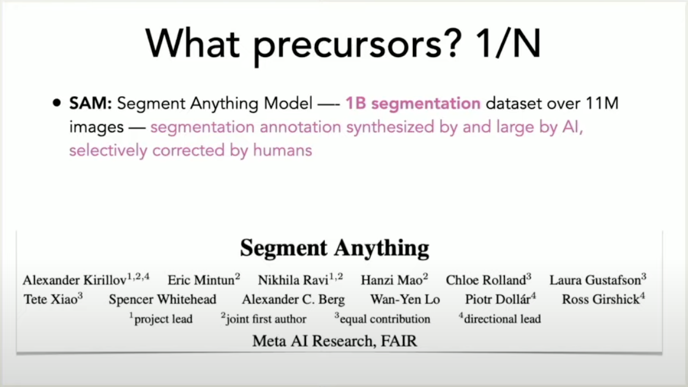
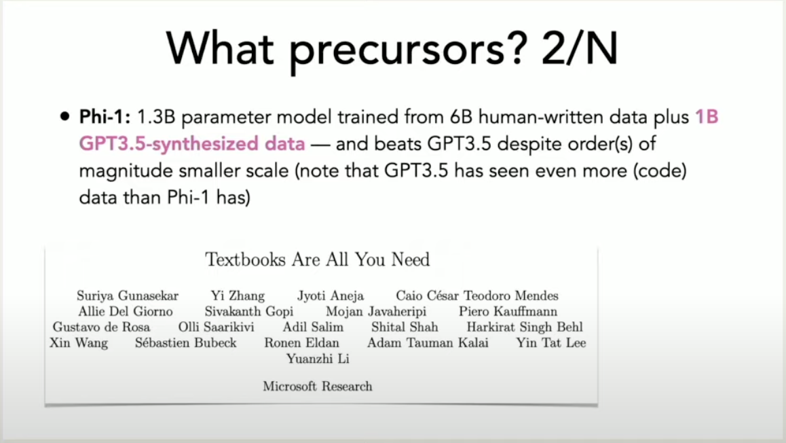
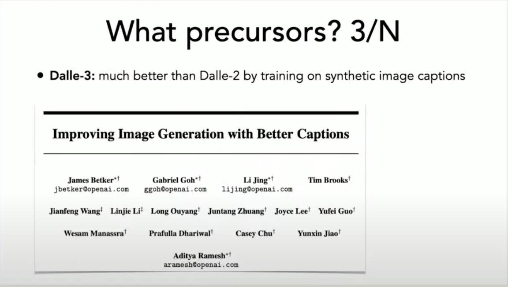

# LMs Vision

## 1-bit LLMs

All LM-s should be 1-bit. (see [BitNet](/ai-tools/LLM/local/tools/bitnet))

## Other

- [ ] Extract papers & vision about small LMs from YT Video [How to Make Small Language Models Work. Yejin Choi Presents at Data + AI Summit 2024](https://www.youtube.com/watch?v=OBkMbPpLCqw)

...

...

...

...

---

- **Multiple LMs** for **different purposes** in the product.
    - Consider supporting different LMs (based on the domain of the Enterprise and on the benchmark results of LMs) and scaffolding them and running locally for the SAFe Portal, e.g. models for 
        - medical domain, 
        - construction, 
        - aerospace, 
        - software engineering,
        - etc.
    - for each domain of the Enterprise (biomed, aerospace, software engineering) there could be a model (or a set of those), scaffolded and ran locally to support the SAFe Portal with high-quality domain-specific data & problem solving 
- **Keep models narrow**
    - according to the **particular domain of application** (e.g. persona, or task, etc.) ?

- LMs should **run locally**
    - LMstudio / Ollama

- LMs should be **fully reproducible**

- **Build own LMs**
    - it seems that **training** / fine-tuning **own LMs is inevitable** if I want to build my own product. Custom-tailored LMs for particular domains or even specific tasks might be what gives the **maximum quality for problem solving**.
        - One possible way forward could be **take a SOTA model and fine-tuning it** with my own data for some purpose
        - Build LM **from scratch** (?)

- **Standardize** in-product **model replacement**
    - Models will come and go, and change. New ones are and will be continuously released, probably enabling access to better models. Which means I have to consider and be ready to monitor for new releases and be able to **train, fine-tunie and incorporate** those into the product **easily** and **quickly**, without much hassle. Which means I have to automate and standardize it. And maybe release as open-source if it's good enough.

---

### Zod for structured extraction from LM responses ?

This one is very specific. Find a proper place to put it in, so that it fits (the outline above is very high-level, while this is very low-level):

- implement structured extraction from LM responses (with [Zod](https://zod.dev/)?)

from article [13 top open-source tools to ship your apps faster ⚡🚀](https://dev.to/composiodev/13-top-open-source-tools-to-ship-your-apps-faster-4ihl) :

11. Zod - TypeScript-first schema validation with static type inference
Zod is a Typescript-first schema validation library that simplifies validating and parsing data while ensuring type safety.

Zod can be beneficial while validating data from APIs and forms and parsing data from dynamic sources when validation and transformation are needed.

Data can be extracted from LLM responses, for example. Even OpenAI uses Zod in its TS SDK for structured extraction from LLM responses.

Key benefits of Zod includes

Zero dependencies
Works in Node.js and all modern browsers
Tiny: 8kb minified + zipped
Immutable: methods (e.g. .optional()) return a new instance
Concise, chainable interface
Functional approach: parse, don't validate
It works with plain JavaScript, too! You don't need to use TypeScript.
