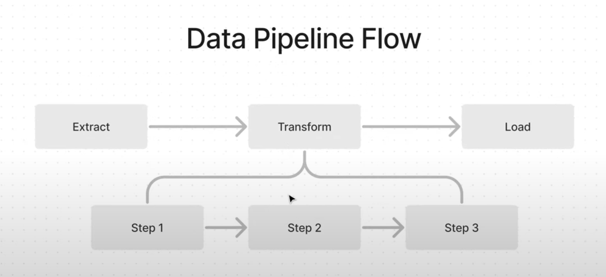

# Trends

Since the tools are evolving so rapidly, it might be a good idea to keep an eye on trends and also describe those, the existing ones and also ones that are yet to unfold. So that users and people in general know more of that the upcoming goals and / or possibilities are.

Like as of August 30 2024, having web access for LLMs is a good thing to have, and at some point would be nice to have it as an open-source thing, run locally. But it's not there yet. Having a 360 overview of such things would be nice.

### AI Companies with AI personas

One trend that we can now particularly see, is the upcoming wave AI Companies (enabled with AI personas).

Take [deepwisdom](https://www.deepwisdom.ai/) as an example. First AI Software Company. Same thing probably to happen in all other areas. Herewith a question - is there a sufficient enough need and logic to keep the breakdown of such personas for AI-software (like what crewAI and MoA implement)? If yes, what are these groundings exactly? If not, why? It could be, that when the software was written manually, different tasks and duties were given to different people because of the human-related limitations, or in order to parallelize the work, etc. Are those justifications in place for the AI?

[Why Agent Frameworks Will Fail (and what to use instead)](https://www.youtube.com/watch?v=KY8n96Erp5Q) (spoiler - use Data Pipelines)

Agentic Frameworks flow

Data pipeline flow

