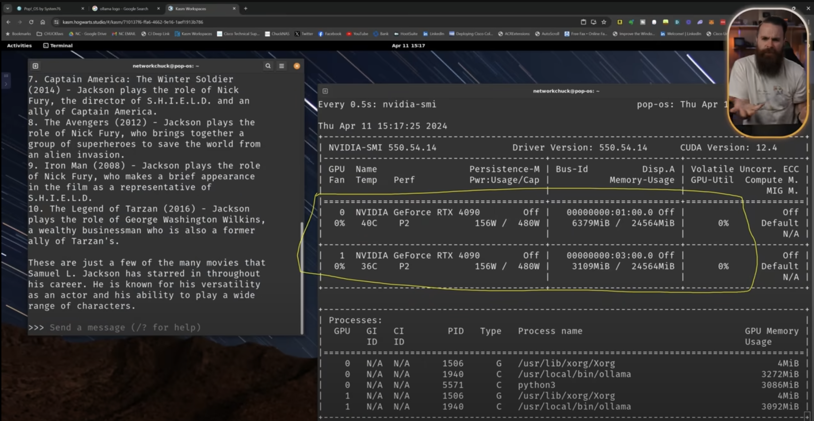

# Hardware

- [INSANE Ollama AI Home Server - Quad 3090 Hardware Build, Costs, Tips and Tricks](https://www.youtube.com/watch?v=JN4EhaM7vyw) 512GB RAM
    - [Ollama AI Home Server ULTIMATE Setup Guide](https://www.youtube.com/watch?v=q_cDvCq1pww)
- [host ALL your AI locally](https://www.youtube.com/watch?v=Wjrdr0NU4Sk)
    
- [$29000 Threadripper Pro 7995WX ㅣRTX 4090 4Way Super Workstion](https://www.youtube.com/watch?v=PAgz6NowMhI)
- [The Build AI Dev Box | Corsair 1000D | 6 x RTX 4090 | W7-3465X](https://www.youtube.com/watch?v=C548PLVwjHA)
- [Mini Rack, HomeLab Stack - Mini Server Rack](https://www.youtube.com/watch?v=kGZa-81IDGY)

https://github.com/NVIDIA/nvidia-container-toolkit

https://github.com/intel-analytics/ipex-llm

---

## nvidia tesla v100

https://www.nvidia.com/en-gb/data-center/tesla-v100/