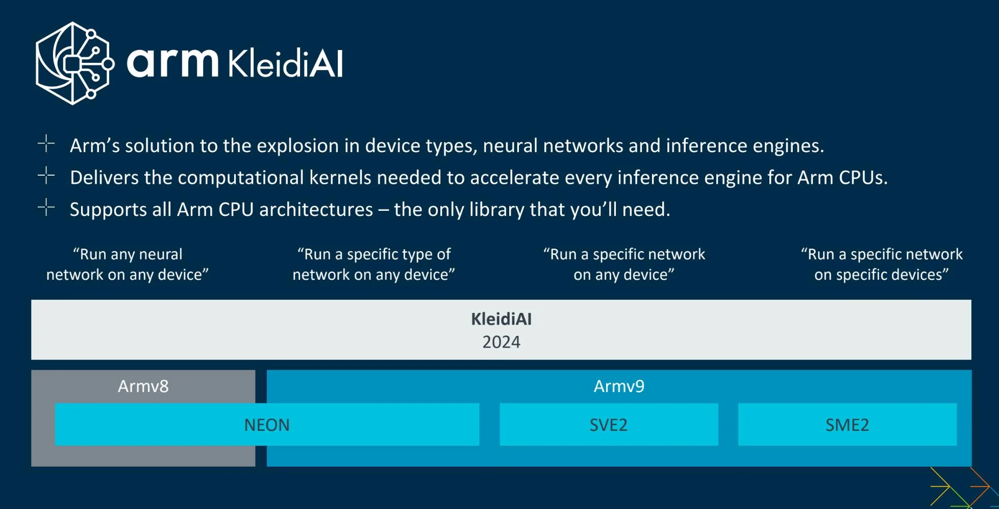

# AI accelerators

Important to understand the optimal approach to AI hardware. GPUs? AI accelerators? ARM chips with ai-accelerators built-in? etc.

## Who needs separate AI accelerators?

Read and extract from:

[Arm is so, so over this AI accelerator unit craze](https://www.theregister.com/2024/05/30/arm_cortex_x925_ai_cores/)

Section **Who needs separate AI accelerators?**

> Arm licenses its **CPU** and **GPU** designs to system-on-chip designers, which themselves **can include** in their processors their own custom **hardware acceleration units for AI** code. These units typically **speed up the execution of** matrix multiplication and other **operations crucial to running neural networks**, handily **taking that work away from the CPU and GPU cores**, and are often referred to as **NPUs** or neural processing units.

> Arm told us that on Android at least, 70 percent of AI inference done by apps usually runs on a device's CPU cores, not the NPU if present nor on the GPU. **Most application code** just **throws** neural network and other **ML operations at the CPU** cores. There are a bunch of reasons why that happens, we presume one being that **app makers don't** want to **make** any **assumptions about** the **hardware** present in the device.

> If it's possible to use a **framework that auto-detects available acceleration** and uses it, great, but **generally: Inference is staying on the CPU**. Of course, first-party apps, such as Google's own mobile software, are expected to make use of known built-in acceleration, such as Google's Tensor-branded NPUs in its Pixel range of phones.

> And here's the main thing: **Arm** staff we spoke to **want** to see **80 to 90 percent of AI inference running on the CPU** cores. That would, for one thing, avoid third-party apps from missing out on acceleration that first-party apps enjoy. That's because, crucially, this approach simplifies the environment for developers: It's OK to run AI work on the CPU cores because modern Arm CPU cores, such as the new Armv9.2 Cortexes above, include acceleration for AI operations at the CPU ISA level.

> Specifically, we're talking about Armv9's [Scalable Matrix Extension (SME2)](https://community.arm.com/arm-community-blogs/b/architectures-and-processors-blog/posts/scalable-matrix-extension-armv9-a-architecture) as well as its [Scalable Vector Extension (SVE2)](https://developer.arm.com/documentation/102340/0100/Introducing-SVE2) instructions.

### Apple M4 chips use Armv9 + SME2

> Arm really wants chip designers to migrate to using **Armv9**, which **brings in more neural network acceleration on the CPU** side. And that's kinda why Arm has this beef with Qualcomm, which is sticking to Armv8 (with NEON) and custom NPUs for its latest Nuvia-derived Snapdragon system-on-chips. You've got the likes of **Apple** on one side **using Armv9 and SME2 in its latest M4 chips**, and Qualcomm and others on the other side persisting with NPUs. Arm would be happier without this fragmentation going forward.

---

> And so that brings us to [KleidiAI](https://newsroom.arm.com/blog/arm-kleidi), a handy [open source library](https://gitlab.arm.com/kleidi/kleidiai) Arm has made available, is still developing, and is said to be upstreaming to projects like the LLM inference driver [Llama.cpp](https://github.com/ggerganov/llama.cpp), that provides a standard interface to all of the potential CPU-level acceleration available on the modern Arm architecture. It's best illustrated with this briefing slide:

[Bringing KleidiAI QB4 Kernels to ExecuTorch](https://github.com/pytorch/executorch/pull/5162)