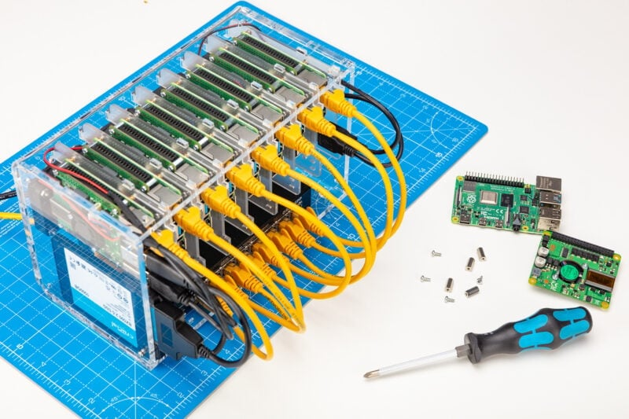

# Cluster

[Supermicro AI super clusters](https://www.supermicro.com/en/solutions/ai-supercluster?utm_source=ai-supercluster&utm_medium=301)

## DeskPi

### RackMate T1 Rackmount, 8U Server Cabinet for Network, Servers, Audio, and Video Equipment

### Super6C

[deskpi-super6c](https://deskpi.com/collections/deskpi-super6c)

### RackMate

https://deskpi.com/collections/deskpi-rack-mate - check all their products

$18.99

### Rackmate 1U Venting Blank Panel

$9.99

---

- [Meet Lightspan MF-8](https://www.youtube.com/watch?v=7RRz_sot_uA)

## Raspberry PI cluster

[How to build a Raspberry Pi cluster](rptl.io/cluster)

Why would you build a physical cluster? Today you can go to Amazon, or Digital Ocean, or any of the other cloud providers, and spin up a virtual machine in seconds. But the cloud is just someone else’s computers: a Raspberry Pi cluster is a low-cost, versatile system you can use for all kinds of clustered-computing related technologies, and you have total control over the machines that constitute it. Building something from the ground up can teach you lessons you can’t learn elsewhere.

---

[Creating a Supercomputer with a Raspberry Pi 5 Cluster and Docker Swarm!](https://www.youtube.com/watch?v=tDENgLiJSh0)

Installing and configuring Docker Swarm
Building a scalable cluster network
Deploying containers and managing services
Harnessing the combined processing power of your cluster

## RPI cluster

[Raspberry Pi Blade crams 64 ARM cores and NVMe in 1U!](https://www.youtube.com/watch?v=zH9GwYZu_aE)

- **160 ARM cores**
- **320GB RAM**
- **20TB of NVMe flash storage** 
- in just 2U 19-inch rack space

---

## Mars 400

[Mars 400 (8 rpis)](https://youtube.com/shorts/oXYzNAUXDr0?si=Y0imAy7Lj0Duygjp)