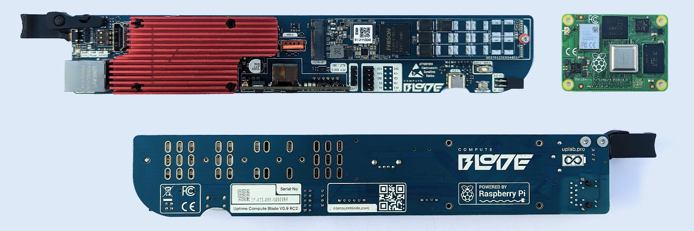
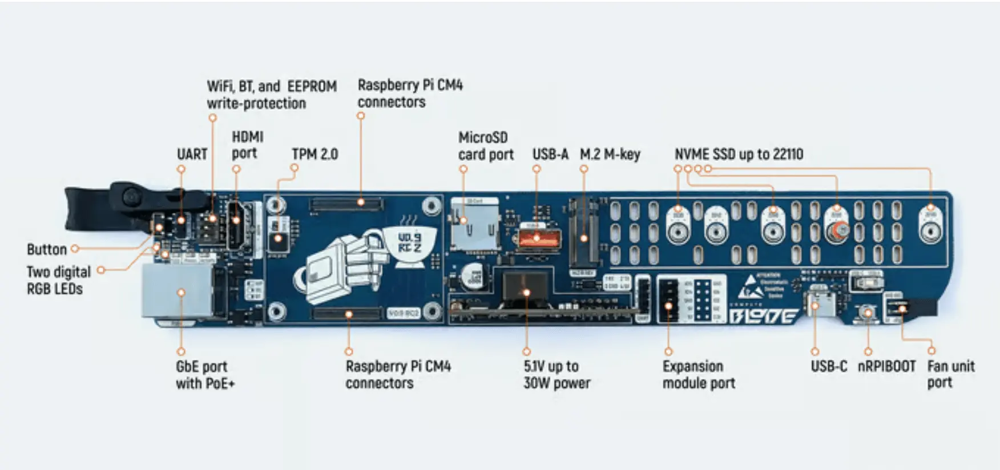
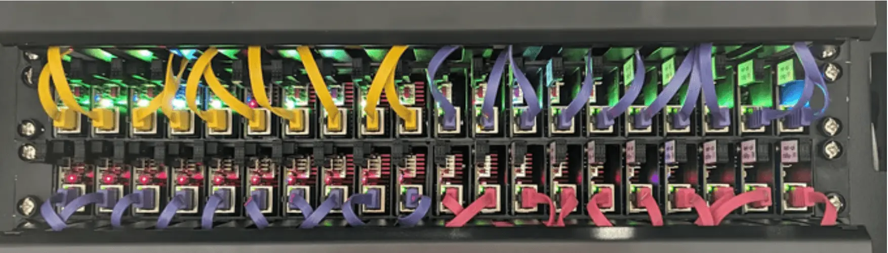

# Compute blade

[computeblade.com](https://computeblade.com)

[Kickstarter: Compute Blade](https://www.kickstarter.com/projects/uptimelab/compute-blade) 

[Raspberry Pi Blade crams 64 ARM cores and NVMe in 1U!](https://www.youtube.com/watch?v=zH9GwYZu_aE)

[ARM yourselves! The Compute Blade is here.](https://www.youtube.com/watch?v=rKDGlpnP-vE)

[Level Up Your Homelab With The Raspberry Pi CM4 Compute Blade](https://www.youtube.com/watch?v=LgsIYHVdFBM)

[Assembling your compute blade cluster!](https://www.youtube.com/watch?v=q43Lb7DBtKs)

- [Merocle Twitter](https://twitter.com/Merocle) (engineer)
    - [personal links](https://uplab.pro/mylink/ls/)

---

- bare metal control

- physical networking

- autodesk [fusion 360](https://www.youtube.com/results?search_query=fusion+360) for PCB design

## Examples

https://uplab.pro/

https://www.instagram.com/uptime.lab/

## Github

[github.com/uptime-industries](https://github.com/uptime-industries/)