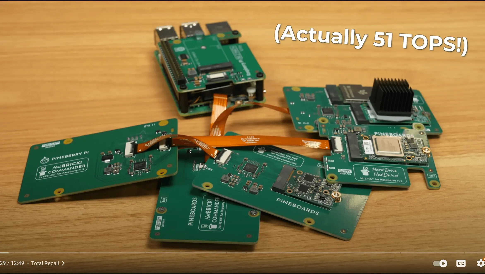
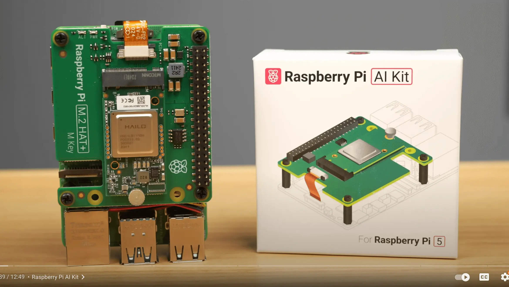
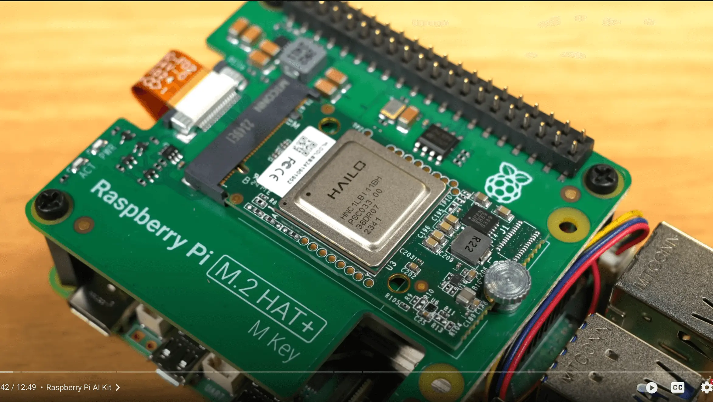

## LLMs on DIY hardware

[The ULTIMATE Raspberry Pi 5 NAS](https://www.youtube.com/watch?v=l30sADfDiM8)

---

[I Built a CoPilot+ AI PC (without Windows)](https://www.youtube.com/watch?v=HgIMJbN0DS0)

---

[Run Local LLMs on Hardware from $50 to $50,000 - We Test and Compare!](https://www.youtube.com/watch?v=mUGsv_IHT-g)

RPI Llama 3.1 too slow. CPU only mode.

---

[Ollama in a RASPI | Running a Large Language Model in a Raspberry Pi](https://www.youtube.com/watch?v=IG5n0AHFvNg)

---

[Local LLM on Raspberry Pi](https://www.youtube.com/watch?v=CeKPXZ_8hkI)

Phi-2
RAM usage: 1.2GB
Speed: 5.5tps