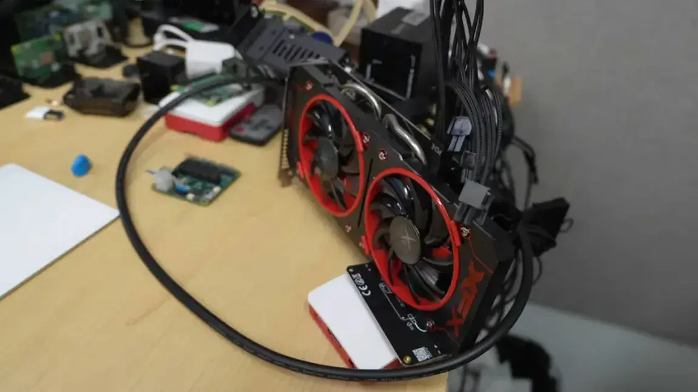
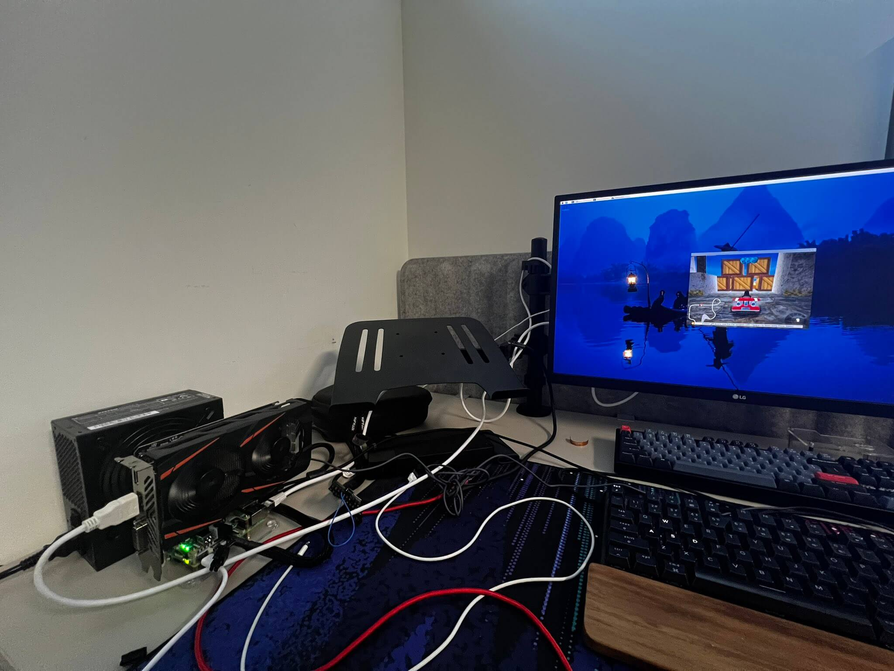
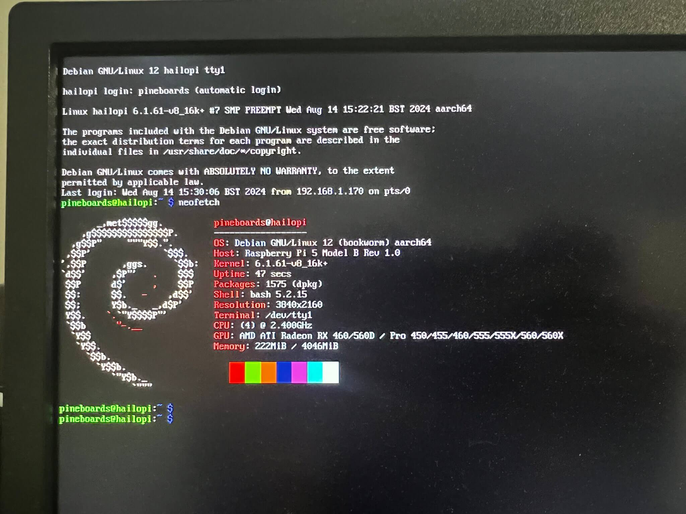
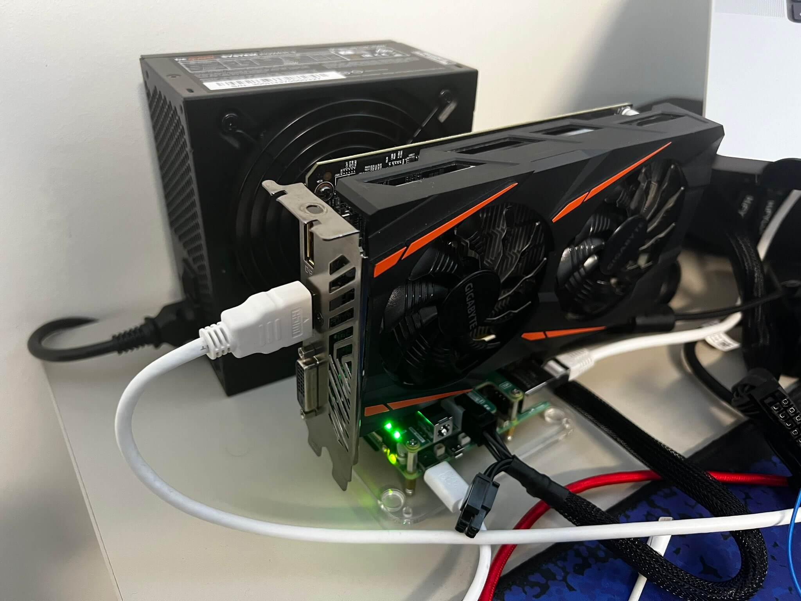
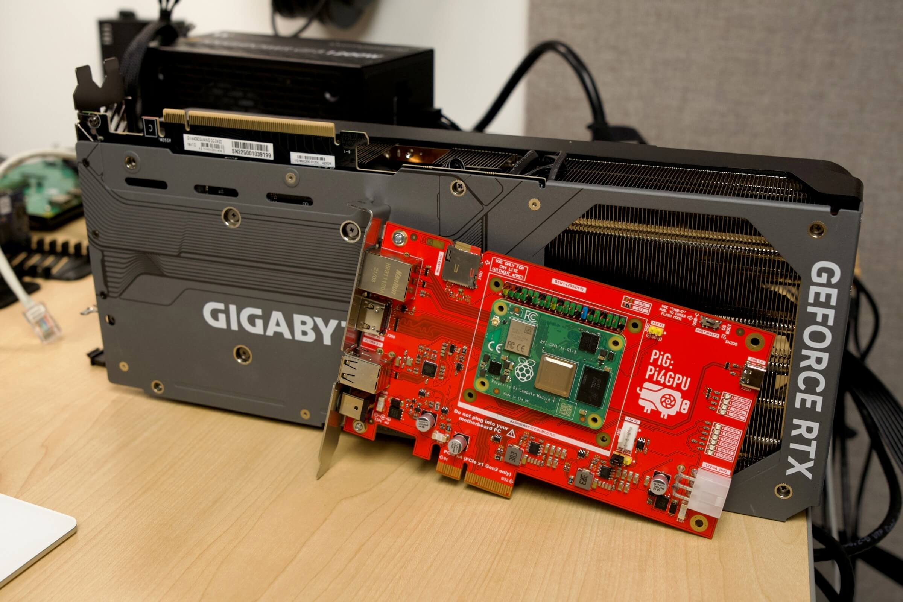
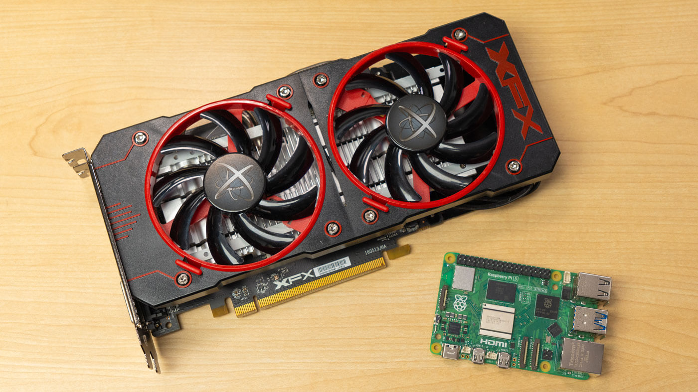
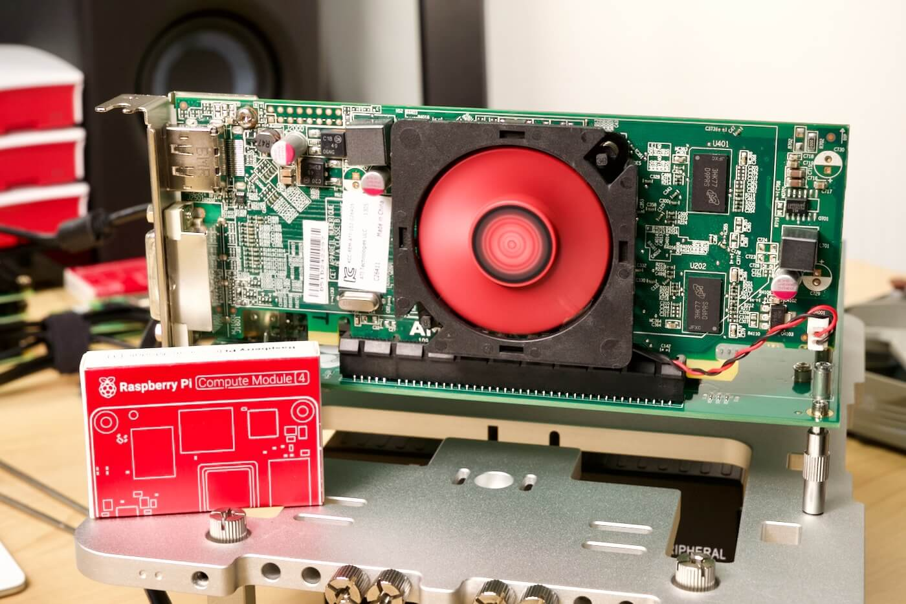

# Raspberry PI with a dedicated GPU

[Jeff Geerling finally unlocks Raspberry Pi external GPU support, and yes it runs Doom... 3 at 4K!](https://www.tomshardware.com/raspberry-pi/jeff-geerling-finally-unlocks-raspberry-pi-external-gpu-support-and-yes-it-runs-doom-3-at-4k) October 10, 2024

---

[Use an External GPU on Raspberry Pi 5 for 4K Gaming](https://www.jeffgeerling.com/blog/2024/use-external-gpu-on-raspberry-pi-5-4k-gaming) October 8, 2024

---

[SuperTuxKart working in 4K on a @Raspberry_Pi 5 without any problems through an external AMD GPU](https://twitter.com/Pineboards/status/1823737321486999775)

---

[Pi4GPU - Raspberry Pi CM4 GPU Carrier Board](https://github.com/geerlingguy/pi4gpu)

[Jeff Geerling. I built a special PCIe card to test GPUs on the Pi](https://www.jeffgeerling.com/tags/pi4gpu)

---

[External GPUs working on the Raspberry Pi 5](https://www.jeffgeerling.com/blog/2023/external-gpus-working-on-raspberry-pi-5)

---

[Jeff Geerling - External graphics cards work on the Raspberry Pi](https://www.jeffgeerling.com/blog/2022/external-graphics-cards-work-on-raspberry-pi) April 27, 2022

