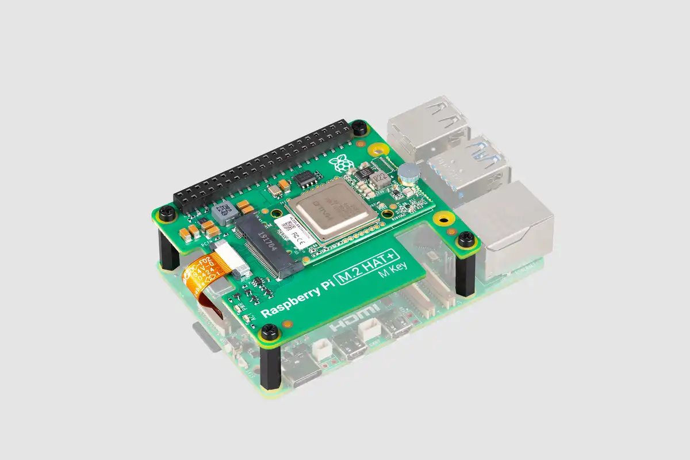

# Raspberry PI AI kit

[Is the new Raspberry Pi AI Kit better than Google Coral?](https://www.youtube.com/watch?v=Q3OYCg-Ak4Q)

[Raspberry Pi AI Kit](https://www.raspberrypi.com/products/ai-kit/)

The Raspberry Pi AI Kit bundles the Raspberry Pi M.2 HAT+ with a Hailo AI acceleration module for use with Raspberry Pi 5. It provides an accessible, cost-effective, and power- efficient way to integrate high-performance AI.

## Overview

The AI module is a 13 tera-operations per second (TOPS) neural network inference accelerator built around the Hailo-8L chip. The module uses the M.2 2242 form factor, and comes pre-installed in the M.2 HAT+, to which it connects through an M key edge connector. The M.2 HAT+ communicates between the AI module’s M.2 interface and the Raspberry Pi 5’s PCIe 2.0 interface.

When the host Raspberry Pi 5 is running an up-to-date Raspberry Pi OS image, it automatically detects the Hailo module and makes the NPU available for AI computing tasks. The built-in rpicam-apps camera applications in Raspberry Pi OS natively support the AI module, automatically using the NPU to run compatible post-processing tasks.