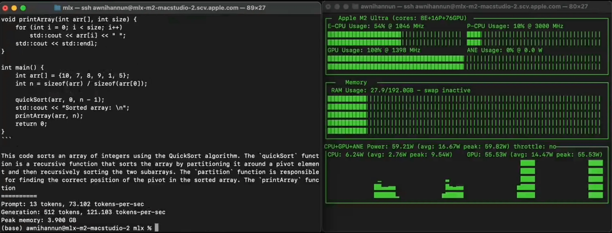

# MLX

- [Local LLMs on Apple Mac - powered by MLX!](https://www.youtube.com/watch?v=7DQsZQzCVuE)

[MLX Guru](https://github.com/ml-explore/mlx/discussions/555)

> It knows the entire MLX documentation (and will be updated as the framework evolves) and can help with your MLX code development. It has the big advantage that at the same it can generate high quality code in Python in general, and in Torch in particular, and understands the nuances of the differences between MLX and Torch so it can handle situations where the two meet each other in your code. Not perfect but I think it speeds up development especially if you are new to MLX.
>
> It is, and will be free, but it requires a ChatGPT Plus subscription at OpenAI.
> 
> Available here: https://chat.openai.com/g/g-7NeyFkq2e-mlx-guru

## Articles

[How Fast Is MLX? A Comprehensive Benchmark on 10 Apple Silicon Chips and 3 CUDA GPUs](https://towardsdatascience.com/how-fast-is-mlx-a-comprehensive-benchmark-on-8-apple-silicon-chips-and-4-cuda-gpus-378a0ae356a0)

[MLX vs MPS vs CUDA: a Benchmark](https://towardsdatascience.com/mlx-vs-mps-vs-cuda-a-benchmark-c5737ca6efc9)

---

[apple.com/mlx](https://opensource.apple.com/projects/mlx/)

MLX is an array framework designed for efficient and flexible machine learning research on Apple silicon.

MLX is an array framework optimized for the unified memory architecture of Apple silicon. The NumPy-like API makes it familiar to use and flexible. The higher level neural net and optimizer packages along with function transformations for automatic differentiation and graph optimization let you build more complex yet efficient machine learning models. MLX also has Swift, C++, and C bindings and can run on any Apple platform.

---

[mlx-benchmark](https://github.com/TristanBilot/mlx-benchmark) - Benchmark of Apple MLX operations on all Apple Silicon chips (GPU, CPU) + MPS and CUDA.

[ml-explore/mlx](https://github.com/ml-explore/mlx) - MLX: An array framework for Apple silicon

[ml-explore.github.io](https://ml-explore.github.io/mlx/build/html/index.html)

[mlx-examples](https://github.com/ml-explore/mlx-examples)

[mlx-examples/llms](https://github.com/ml-explore/mlx-examples/tree/main/llms)

## Utilization of unified memory

> The design of MLX is inspired by frameworks like PyTorch, Jax, and ArrayFire. A notable difference from these frameworks and MLX is the **`unified memory model`**. **Arrays** in MLX **live in shared memory**. **Operations** on MLX arrays **can be performed** on any of the supported device types **without** performing **data copies**. Currently supported device types are the CPU and GPU.

> Addresses [Why LLMs use so much RAM?](/hardware/considerations#why-llms-use-so-much-ram) and [ML Hardware specifics](/hardware/considerations#ml-hardware-specifics)

## MLX-graphs

[MLX-graphs](https://mlx-graphs.github.io/mlx-graphs/)

MLX-graphs is a library for Graph Neural Networks (GNNs) built upon Apple's [MLX](https://github.com/ml-explore/mlx).

## Features

- **Fast GNN training and inference on Apple Silicon**

   ``mlx-graphs`` has been designed to run GNNs and graph algorithms *fast* on Apple Silicon chips. All GNN operations
   fully leverage the GPU and CPU hardware of Macs thanks to the efficient low-level primitives
   available within the MLX core library. Initial benchmarks show an up to 10x speed improvement
   with respect to other frameworks on large datasets.
- **Scalability to large graphs**

   With unified memory architecture, objects live in a shared memory accessible by both the CPU and GPU.
   This setup allows Macs to leverage their entire memory capacity for storing graphs.
   Consequently, Macs equipped with substantial memory can efficiently train GNNs on large graphs, spanning tens of gigabytes, directly using the Mac's GPU.
- **Multi-device**

   Unified memory eliminates the need for time-consuming device-to-device transfers.
   This architecture also enables specific operations to be run explicitly on either the CPU or GPU without incurring any overhead, facilitating more efficient computation and resource utilization.

## Apple Silicon + MLX vs CUDA + PyTorch. Benchmark.

From [MLX vs MPS vs CUDA: a Benchmark](https://medium.com/p/c5737ca6efc9)

> From [How Fast Is MLX? A Comprehensive Benchmark on 10 Apple Silicon Chips and 3 CUDA GPUs](https://towardsdatascience.com/how-fast-is-mlx-a-comprehensive-benchmark-on-8-apple-silicon-chips-and-4-cuda-gpus-378a0ae356a0):
>
> These results show the average training time per epoch of a Graph Convolutional Network model, essentially composed of two linear layers. Differing from the benchmarks in this article, this specific benchmark evaluates the average runtime of a complete training loop, including the time for data transfers from CPU to GPU.

These results bring an interesting insight to light: the performance of CUDA GPUs noticeably slows down when real data transfer times are included. This underlines the significant impact that data transfers have on overall speed, a factor that we can’t overlook in the current benchmark.

**CUDA V100 PCIe & NVLINK**: only 23% and 34% faster than M3 Max with MLX, this is some serious stuff!

MLX stands out as a game changer when compared to CPU and MPS, and it even comes close to the performance of a TESLA V100. This initial benchmark highlights MLX’s significant potential to emerge as a popular Mac-based deep learning framework. It’s also worth noting that MLX has only recently been released to the public, and we can expect further enhancements from the open-source community in the coming years. We can also expect even more powerful Apple Silicon chips in the near future, taking performance of MLX to a whole new level.

### To recap

**Cool things:**

- We can now run deep learning models locally by leveraging the full power of Apple Silicon.
- The syntax is pretty much similar as torch, with some inspirations from Jax.
- No more device, everything lives in unified memory!

**What’s missing:**

- The framework is very young, many features are missing yet. Especially for Graph ML, all sparse operations and scattering APIs are not available at the moment, making it complicate to build Message Passing GNNs on top of MLX now.
- As a new project, it’s worth noting that both the documentation and community discussions for MLX are somewhat limited at present.

> In conclusion, MLX made a surprisingly impactful entrance upon its release and demonstrates serious potential. I believe this framework could become a staple for daily research experiments. We’re also eager to see additional experiments, as the GCN tests primarily showcase MLX’s performance on basic linear layers. More comprehensive testing could reveal its full capabilities.

---

[How Fast Is MLX? A Comprehensive Benchmark on 10 Apple Silicon Chips and 3 CUDA GPUs](https://towardsdatascience.com/how-fast-is-mlx-a-comprehensive-benchmark-on-8-apple-silicon-chips-and-4-cuda-gpus-378a0ae356a0) - A benchmark of the main operations and layers on MLX, PyTorch MPS and CUDA GPUs.

> CUDA GPUs remain inevitably faster than Apple Silicon.

## Apple Silicon vs CUDA GPU

> While CUDA GPUs are undeniably faster, it’s crucial to take a step back and consider the broader picture. Nvidia has spent years perfecting its GPU technology, reaching a level of maturity and performance that currently stands unrivaled. When you weigh the differences in hardware sophistication, maturity, and cost between Nvidia GPUs and Apple Silicon chips, it offers a significant perspective.

> This is where MLX comes into its own. This framework becomes particularly beneficial in scenarios where one needs to run large models on their personal Mac. With MLX, you can achieve this without the need for additional, expensive GPU hardware. It’s a game-changer for those seeking efficient machine learning capabilities directly on their Mac devices.

> Notably, running [LLM inference directly on Apple Silicon with MLX](https://huggingface.co/mlx-community?sort_models=likes#models) has gained increasing popularity recently.

## MLX Rust

[mlx-rs](https://github.com/oxideai/mlx-rs) - Rust bindings for Apple's mlx machine learning library.

---

## Macstudio 120 tokens per second (Mistral 7B)

[120+ toks/sec on an M2 Ultra! With the latest MLX, 4-bit Mistral 7B](https://x.com/awnihannun/status/1849922613403058398)

[Local LLMs on Apple Mac - powered by MLX!](https://www.youtube.com/watch?v=7DQsZQzCVuE)

---

## mlx-vlm

[Blaizzy/mlx-vlm](https://github.com/Blaizzy/mlx-vlm)

MLX-VLM is a package for running Vision LLMs locally on your Mac using MLX.