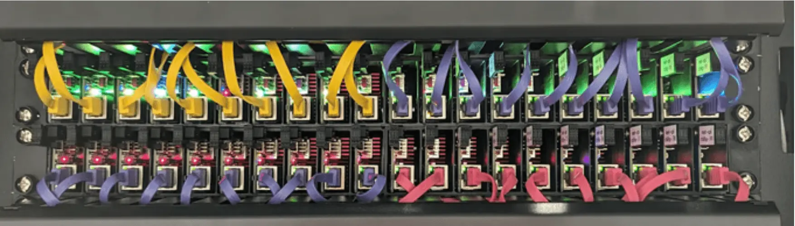

# Requirements for Hardware

## Reqs for a cluster

Get a [CB (RPI) cluster](/hardware/cluster#rpi-cluster) (20 nodes in 1U)

with this [form-factor](/hardware/diy-hardware/compute-blade)

with [GPUs](/hardware/diy-hardware/raspberrypi-dgpu)

Each node specs:

- 512 GB RAM
- 48GB of GPU Memory
    - rtx 6000 [specs for tops](https://www.nvidia.com/en-us/design-visualization/rtx-6000/)
        - Single-Precision Performance 91.1 TFLOPS
        - RT Core Performance 210.6 TFLOPS
        - Tensor Performance 1457 AI TOPS

Basically, we need a cluster of CBs with dGPUs for each node. (CI jobs for MLOps require certain hardware for training, tuning, evaluating LMs).

[amd-radeon-rx-7900xtx](https://www.amd.com/en/products/graphics/desktops/radeon/7000-series/amd-radeon-rx-7900xtx.html) looks like we need graphic cards comparison by specs

## My Requirements for personal laptop

My requirements for a personal laptop (Macbook Pro):
- Run Llama 405B, train/finetune/serve in no time

Currently available latest & top performance [macbook pro](https://www.apple.com/shop/buy-mac/macbook-pro/16-inch-space-black-apple-m3-max-with-16-core-cpu-and-40-core-gpu-48gb-memory-1tb)
with its 128GB of unified memory (Apple M3 Max chip with 16‑core CPU, 40‑core GPU, 16‑core Neural Engine) seems 
not to be enough. 5k$ with 1TB SSD, 7.2k$ with 8TB SSD. In the best base, run llama 70B on it. We def need a much more performant
machine, 128 shared memory is not enough. 

On the other side, all that provokes a thought about what personal hardware setup might look like. Especially, if you're
travelling and not constantly ried to one place. What imposes certain limitations as to what you can carry with you
in order to stay mobile comfortably.

Ideally, we should get a much more hardware-wise performant mac laptop. Besides this, we can also think of this - 
what optimal (both performance & cost-wise) hardware setup for AI-dev might look like? I mean not just for playing
with 1B models, which is already not bad, but for being able to build SOTA AI-products or close to them. Ideally, it means
running big models locally fast. So, memory-wise from 128GB RAM and more. GPU-wise, as for inference-speed (50 tokens per second and above),
numbers yet to be analyzed.

If you can't run models locally (on your laptop), then the next best alternative seems to be build a compute cluster
for an AI-server (and anything else, e.g. CI-server). Perform all AI-related compute-heavy ops there, and use personal
devices for remote-access only. In the case if existing hardware doesn't make a significant stepup in compute power,
this will pretty mich be the only choice. 
Could be compute blade 19" rack cluster at €3,820 (4.2k$). 80 ARM cores, 160GB RAM, 10TB NVMe. (OPTIONAL: Up to 160TB NVMe flash storage).
But that's still a question though, since CB-cluster is still 20 nodes, i.e. 20 different computers. Thus question - does
having all these 160GB RAM in SUM mean the same LM training-wise as 128GB on a single mac machine?
Core-wise there is also a big difference (for CPUs, 16 cores vs 80).

If I get it right, the CB-cluster was initially developed for running CI, which
totally makes sense. What about AI? 

---

Consider [Apple M4 chips use Armv9 + SME2](/hardware/ai-accelerators#apple-m4-chips-use-armv9--sme2). How many tops? Need exact benchmark with ollama + LMs for:
- training
- inference
    - latency
- RAM usage

## Software Requirements

My requirements towards nx:

- One cross-programming-language tool to handle apps/libs & ops on them from one UI.
- One VScode UI to manage:
    - javascript
        - node
        - deno
        - npm
        - jsr
    - Rust
        - crates
    - etc.

I mean not separate nx workspaces for each language (like it is now, one nx workspace for Rust,
another one for javascript). But one for all languages.