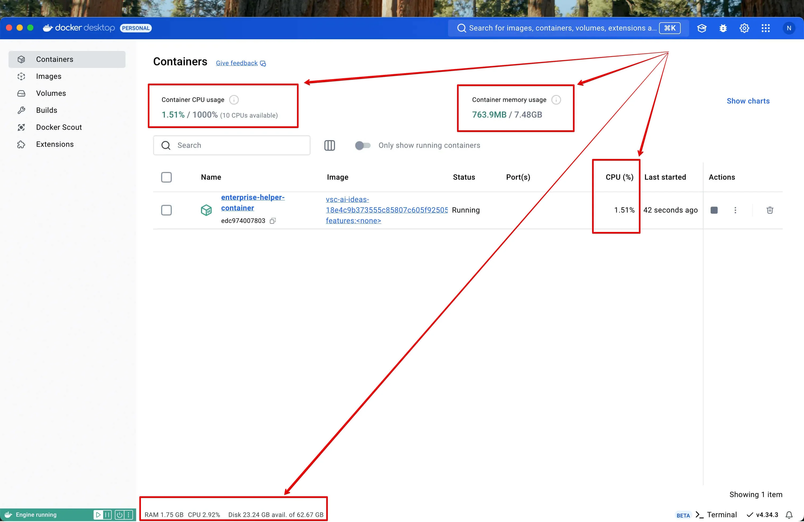

# Hardware

## Consumption

A running container consumes certain amount of CPU, RAM and Disk Space. This has to be taken into account as it:

- raises entry barrier into application development for low-performance hardware
- sets hardware requirements
- set hardware limitations (what maximum amount of containers (& with what kind & load of activities) a machine can handle?)

> Question: how is RAM allocated to a container? The screenshot was taken on a machine with 16GB RAM, but max container memory usage is indicated as 7.48GB. Why? Is it possible to specify somehow memory allocation for a container?

## Requirements

To comfortably run **Enterprise Helper** devcontainer following resources are required:

- **Disk space**: `X` GB
- **RAM**: `Y` GB
- **CPU**: `Z` MHz 

## Limitations

- Macbook Pro M2
    - N containers
        - description ...
- Macbook Pro M3
- Macbook Pro M4