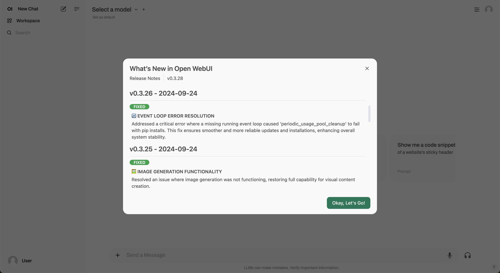

# Distribution

How should the product be distributed?

Examples:

## JanAI

[JanAI](https://github.com/janhq/jan?tab=readme-ov-file#download)

Jan runs on any hardware. From PCs to multi-GPU clusters, Jan supports universal architectures:

- NVIDIA GPUs (fast)
- Apple M-series (fast)
- Apple Intel
- Linux Debian
- Windows x64

[jan downloads](https://github.com/janhq/jan?tab=readme-ov-file#download)
    - .exe for Windows
    - dmg for MacOS Intel / M1,2,3,4
    - Linux .deb / .AppImage

## Llamafile

https://github.com/ggerganov/llama.cpp

https://github.com/jart/cosmopolitan

Cosmopolitan Libc makes C a build-once run-anywhere language, like Java, except it doesn't need an interpreter or virtual machine. Instead, it reconfigures stock GCC and Clang to output a POSIX-approved polyglot format that runs natively on Linux + Mac + Windows + FreeBSD + OpenBSD + NetBSD + BIOS with the best possible performance and the tiniest footprint imaginable.

---

## open-webui

Consider communicating changelog in the product (not just in github) as in [open-webui](https://github.com/open-webui/open-webui/releases).

---

---

---
