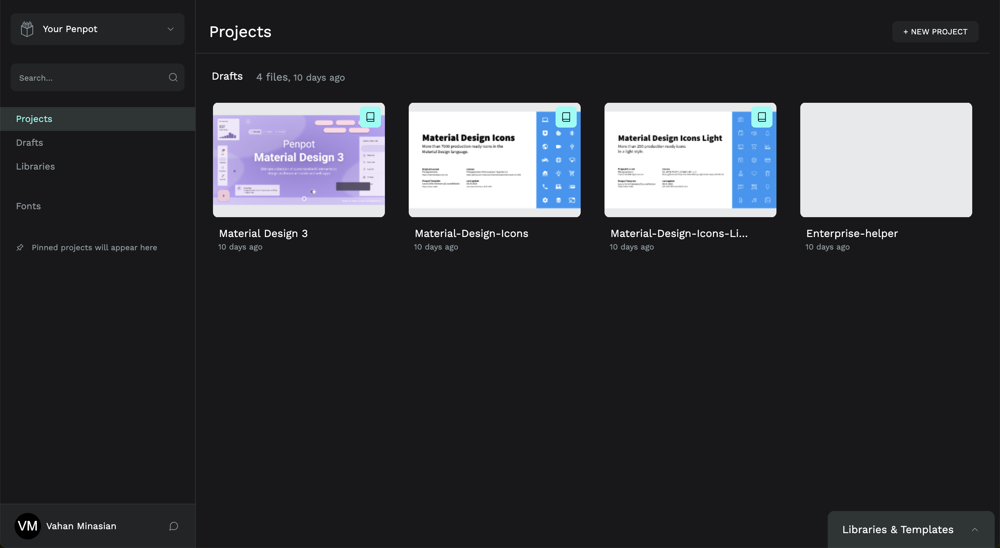

# Enterprise

## Enterprise CRUD page
Should we introduce an entity "Enterprise" and have a UI with CRUD for it?
e.g. create enterprises (like in figma/penpot when creating a new project?). And then for each project select a flavor (?).

## Enterprise details page

in SAFe: [Enterprise](https://scaledagileframework.com/enterprise/)

### Enterprise Portfolio Management

...

#### Collaborations

...

#### Defining Enterprise Portfolio Strategic Themes

...

#### Allocating Portfolio Budgets

...

#### Coordinating Cross-Portfolio Initiatives

...

#### Measuring Enterprise Portfolio Performance

...

#### Organizing Portfolios

...

