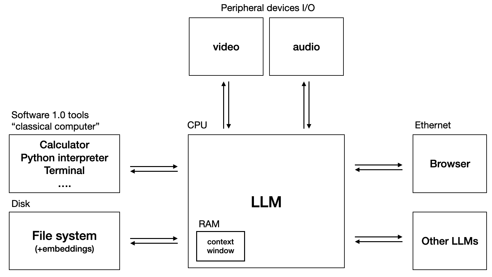
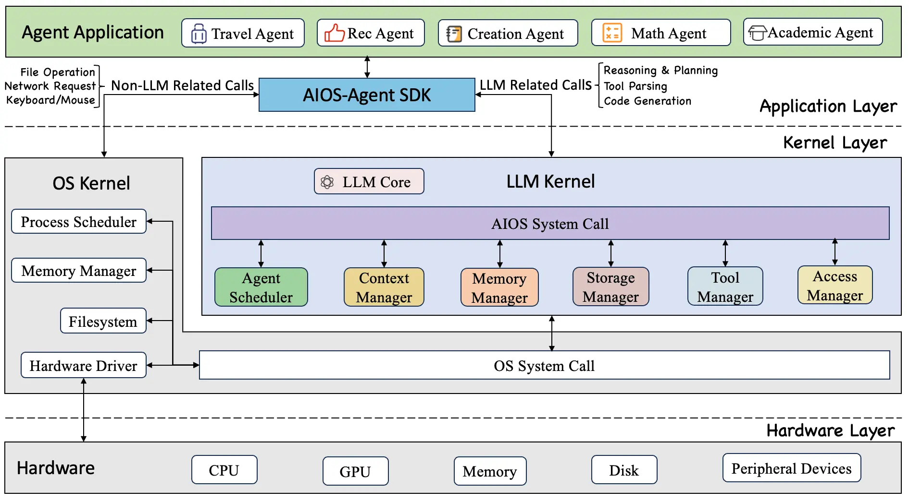

# OS Control

## LLM OS

### Andrej Karpathy's LLM OS

- From `[1hr Talk] Intro to Large Language Models` talk by Andrej Karpathy (YT)
    - [LLM OS](https://www.youtube.com/watch?v=zjkBMFhNj_g&t=2535s)

[xeet 1](https://x.com/karpathy/status/1723140519554105733?lang=en):

> LLM OS. Bear with me I'm still cooking.
> 
> Specs:
> - LLM: OpenAI GPT-4 Turbo 256 core (batch size) processor @ 20Hz (tok/s)
> - RAM: 128Ktok
> - Filesystem: Ada002

[xeet 2](https://x.com/karpathy/status/1707437820045062561?lang=en):

> With many 🧩 dropping recently, a more complete picture is emerging of LLMs not as a chatbot, but the kernel process of a new Operating System. E.g. today it orchestrates:
>
> - Input & Output across modalities (text, audio, vision)
> - Code interpreter, ability to write & run programs
> - Browser / internet access
> - Embeddings database for files and internal memory storage & retrieval
>
> A lot of computing concepts carry over. Currently we have single-threaded execution running at ~10Hz (tok/s) and enjoy looking at the assembly-level execution traces stream by. Concepts from computer security carry over, with attacks, defenses and emerging vulnerabilities.
>
> I also like the nearest neighbor analogy of "Operating System" because the industry is starting to shape up similar:
Windows, OS X, and Linux <-> GPT, PaLM, Claude, and Llama/Mistral(?:)).
An OS comes with default apps but has an app store.
Most apps can be adapted to multiple platforms.
>
> TLDR looking at LLMs as chatbots is the same as looking at early computers as calculators. We're seeing an emergence of a whole new computing paradigm, and it is very early.

### AIOS

- [agiresearch/AIOS](https://github.com/agiresearch/AIOS)
    - embed large language model into the operating system as the brain of the OS. AIOS is designed to address proble

### Resources

- [bilalonur/awesome-llm-os](https://github.com/bilalonur/awesome-llm-os)
- [Illustrated LLM OS: An Implementational Perspective](https://huggingface.co/blog/shivance/illustrated-llm-os) hf.co, December 3, 2023
- Medium articles (Protégé IGDTUW)
    - [Part 1 : Introduction to LLM OS](https://medium.com/@protegeigdtuw/part-1-introduction-to-llm-os-1cfec39689f7) medium, Mar 31, 2024
    - [Part 2 : Challenges and Solutions to LLM OS](https://medium.com/@protegeigdtuw/part-2-challenges-and-solutions-to-llm-os-1cc0fec2ac57)
    - [Part 3 : Implementation and technology of LLM OS](https://medium.com/@protegeigdtuw/part3-implementation-and-technology-of-llm-os-a3d296a2ab73)
    - [Part 4 : Use cases and User experiences -LLM OS](https://medium.com/@protegeigdtuw/part-4-use-cases-and-user-experiences-llm-os-71f6d0763773)

### Other examples

- [letta](https://www.letta.com/)
    - open source framework for building stateful LLM applications
    - [MemGPT](https://github.com/cpacker/MemGPT)

## open interpreter

[open-interpreter](https://github.com/OpenInterpreter/open-interpreter)

[Introducing Local III](https://changes.openinterpreter.com/log/local-iii)

[changes.openinterpreter.com](https://changes.openinterpreter.com/)

[FREE: AI Agent Controls Your Mouse & Computer! Open Interpreter OS Mode (Screenshots)🤖 Open Source](https://www.youtube.com/watch?v=DBhdccyVqUs)

## OSWorld

- [os-world.github.io](https://os-world.github.io/)
- [OSWorld](https://github.com/xlang-ai/OSWorld) github
- paper [OSWorld: Benchmarking Multimodal Agents for Open-Ended Tasks in Real Computer Environments](https://arxiv.org/abs/2404.07972) / [pdf](https://arxiv.org/pdf/2404.07972)

### Agent-S

- [simular.ai/agent-s](https://www.simular.ai/agent-s)
- [github.com/simular-ai/Agent-S](https://github.com/simular-ai/Agent-S)
- paper [Agent S: An Open Agentic Framework that Uses Computers Like a Human](https://arxiv.org/abs/2410.08164)

### Windows Agent Arena

> We built a scalable open-sourced framework to test and develop AI agents that can reason, plan and act on a PC using language models

- [Windows Agent Arena](https://microsoft.github.io/WindowsAgentArena/)
- paper [Windows Agent Arena: Evaluating Multi-Modal OS Agents at Scale](https://arxiv.org/abs/2409.08264)
- github [microsoft/WindowsAgentArena](https://github.com/microsoft/WindowsAgentArena)

Windows Agent Arena (WAA) 🪟 is a scalable OS platform for testing and benchmarking of multi-modal AI agents.

### Mind2Web

- [osu-nlp-group.github.io/Mind2Web](https://osu-nlp-group.github.io/Mind2Web/)
- paper [Towards Learning a Generalist Model for Embodied Navigation](https://arxiv.org/abs/2312.02010)
- [NaviLLM](https://github.com/zd11024/NaviLLM) - [CVPR 2024] The code for paper 'Towards Learning a Generalist Model for Embodied Navigation'

Mind2Web is a dataset for developing and evaluating generalist agents for the web that can follow language instructions to complete complex tasks on any website. Mind2Web contains 2,350 tasks from 137 websites spanning 31 domains that:
- Reflect diverse and practical use cases on the web.
- Provide challenging yet realistic environments with real-world websites.
- Test generalization ability across tasks and environments.

