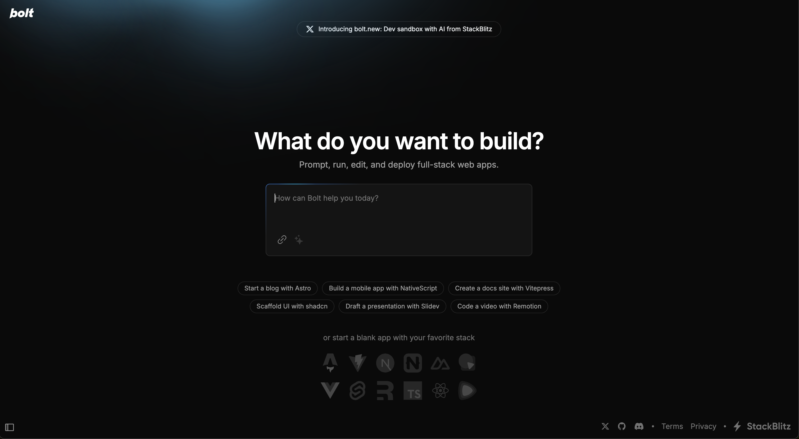
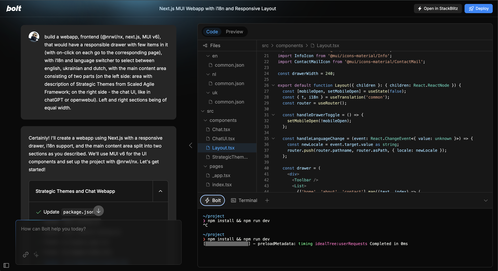
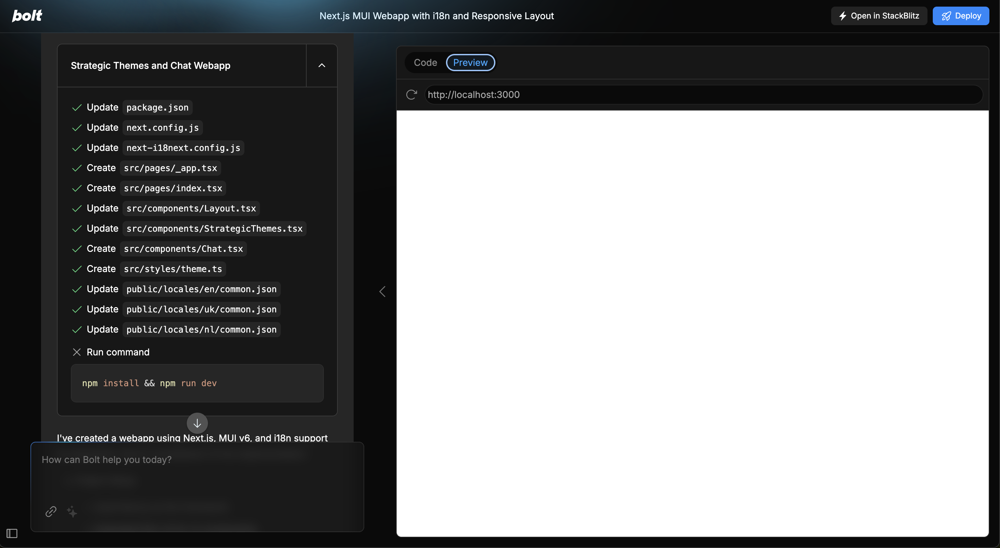
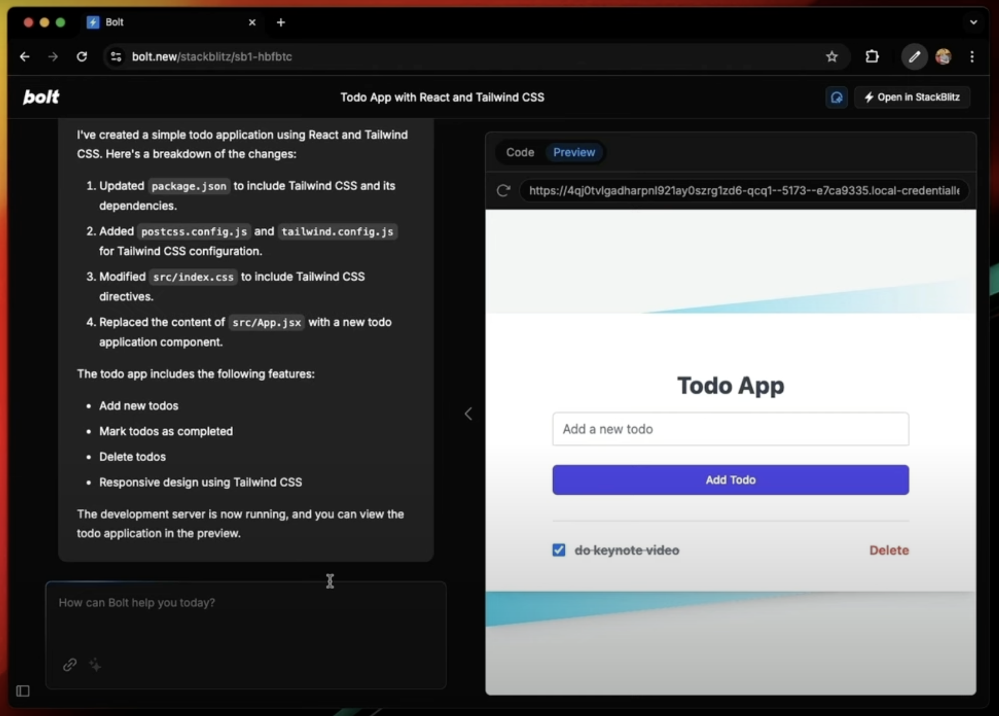

# software engineer AI

## Features

- Implement PR automerge with [bulldozer](https://github.com/palantir/bulldozer) or something similar
- [palantir/policy-bot](https://github.com/palantir/policy-bot )
A GitHub App that enforces approval policies on pull requests (?)

## Inspiration

### Code intelligence

- Add **code-intelligence** tool (for code search, fix, update) across codebases
    - with [sourcegraph](https://sourcegraph.com/) or something similar (& maintained as open-source)
    - https://github.com/sourcegraph/sourcegraph-public-snapshot

### VSCode 

#### VSCode in the browser

[code-server](https://github.com/coder/code-server)

- [ ] Consider using code-server

Run VS Code on any machine anywhere and access it in the browser.

#### VSCode remote development

do we need to use [vs-code-remote-development](/software-engineering/vscode#vs-code-remote-development) ?

### Gitpod or Webcontainers ?

and? or? try both

### Gitpod

Standardized and automated development environments
Self-host in 3 minutes

- [ ] Consider using [Gitpod](/software-engineering/web-containers#gitpod) (dev environments on demand). Spin up a dev environment fully setup & ready for dev with 1 click.

- [Gitpod website and documentation](https://github.com/KlasenK/website)

- [gitpod-io/workspace-images](https://github.com/gitpod-io/workspace-images) Ready to use docker images for Gitpod workspaces
    - [gitpod.io/docs/.../workspace-image](https://www.gitpod.io/docs/configure/workspaces/workspace-image)

### e2b fragments

Can use it as an open-source next.js template to lookup possible implementations

- [E2B Fragments](https://www.youtube.com/watch?v=2HKtVGz6xVs)
    - [fragments.e2b.dev](https://fragments.e2b.dev/)
    - [github.com/e2b-dev/fragments](https://github.com/e2b-dev/fragments)

### [bolt.new](/software-engineering/bolt-new)

We need two things:
- [ollama support](https://github.com/stackblitz/bolt.new/issues/36) by bolt.new  
- and open-source tool for [computer-use](https://www.anthropic.com/news/3-5-models-and-computer-use) for local llms via ollama
    - Introducing [computer use](https://www.anthropic.com/news/3-5-models-and-computer-use), a new Claude 3.5 Sonnet, and Claude 3.5 Haiku
    - [Developing a computer use model](https://www.anthropic.com/news/developing-computer-use)
    - [OSWorld: Benchmarking Multimodal Agents for Open-Ended Tasks in Real Computer Environments](https://os-world.github.io/)
        - [xlang-ai/OSWorld](https://github.com/xlang-ai/OSWorld)
        - paper: [OSWorld: Benchmarking Multimodal Agents for Open-Ended Tasks in Real Computer Environments](https://arxiv.org/abs/2404.07972)

use [bolt.new](bolt.new) as an inspiration

- chat with LM on the left side
- web-container with dev environment on the right-side
    - code IDE
    - browser with preview
    - terminal
    - deploy

---

Step 1. chatUI

Step 2. Make a prompt. Boot webcontainer with code IDE & browser.

Step 3. Preview

---

## Opensource

Since this bolt.new kind of UI is something generic for AI, regardless of field of application, it makes sense to develop an open-source tool that would allow to easily implement it. 

- Options
    - **nx generator** (has to be maintained)
        - next.js + MUI
    - github seed repo to showcase

---

## Develop feature (Enterprise-helper)

### 0.2 vision (bolt.new-like)

- Build with next.js + MUI + webcontainers + openinterpreter (?)
- Try to implement a working solution (an operating system in a web-container manipulated by LM)
- Try to get it working

### 0.1 vision (with OpenHands)
(Local open-source)

- Possible implementation - [**OpenHands github**](https://github.com/All-Hands-AI/OpenHands) / [**all-hands.dev**](https://www.all-hands.dev/)
    - paper [OpenDevin: An Open Platform for AI Software Developers as Generalist Agents](https://arxiv.org/abs/2407.16741)
    - [Youtube Video 1](https://www.youtube.com/watch?v=Q3DyeIV96tY)
    - [Youtube Video 2](https://www.youtube.com/watch?v=FCqsjwfmrmM)
    - [Youtube Video 3](https://www.youtube.com/watch?v=dKD4a_sv69o)
    - Context
        - [gh issue: ollama](https://github.com/All-Hands-AI/OpenHands/issues/3960)
        - [old: Using Ollama](https://github.com/All-Hands-AI/OpenHands/discussions/509)
        - [old2: ollama](https://github.com/All-Hands-AI/OpenHands/discussions/2088)
        - [Local LLM Guide](https://github.com/All-Hands-AI/OpenHands/commit/08a2dfb01af1aec6743f5e4c23507d63980726c0)
        - [docs: LLM Backends](https://docs.all-hands.dev/modules/usage/llms)
    - Where is easy Ollama integration? With easy local model switching?

---

## Work on tickets & ticket sequenes

For software engineering AI shift from execution for generating apps **from a single [text prompt](/product/features/software-engineer-ai/user-input#text-prompt)** to **generating** code (apps, libs) **from [tickets](/product/features/ticket-system/ticket) and their [sequences](/product/features/ticket-system/ticket-sequence)**.

1. Describe desired functionality of the app in a [sequence of tickets](/product/features/ticket-system/ticket-sequence).
2. Execute prompt to generate an app on a [sequence of tickets](/product/features/ticket-system/ticket-sequence).
3. By this we have atomicity in the definition of app's functionality. And we can prompt the LM again to regenerate a certain part of the application by simply providing a ticket number with instructions to regenerate the app's part of it.
4. Having [ticket sequences](/product/features/ticket-system/ticket-sequence) to execute on is also better because tickets are a way to [persist prompts](/product/features/ticket-system/ticket#prompt-persistence) also, and abstract away certain parts of it into a persistent form, which can be acted on again and again for different purposes, e.g.:
    - **[re-execution of the prompt](/product/features/software-engineer-ai/prompt-execution#re-execution-of-the-prompt)** by a LM in case if the results of previous execution of it were unsatisfactory
    - **[manual evaluation of the model](/product/features/ticket-system/ticket#manual-evaluation)** performance in generating the code by real human, expert, by hand
5. Ideally models should be lightweight for easy local storing and (re) training on consumer grade laptops quickly. [Manual evaluation](/product/features/ticket-system/ticket#manual-evaluation) (expert?) and enhancement of the performance with [human feedback](/product/features/ticket-system/ticket#human-feedback-form) should also be easy. Providing Human Feedback should be possible on every LM generating action (as a Feedback button on every Stackblitz docs page).
6. [Ticket Sequences](/product/features/ticket-system/ticket-sequence) can be **saved** and **shared** (on the web with other users) as a versioned and **released library (package)**. Which is easy to install. Which means we're abstracting such entity as sequences away from the implementation, allowing it to be used by any other software engineering AI tool.

## Codegen vision

We might have a layered approach for code generation.

1. Layer of LM (code generated directly by LM)
2. Layer of code-generators (e.g. nx generators)

We might:

1. Create and maintain some (or many) nx generators, that generate working code with the tools we love. In a fixed manner. (No LLM flexibility in writing the code, but reliability because of manual maintenance).
2. Train an LM to use these code generators for certain tasks (possibly, for all posible use cases).
    - for this we could **[codify all typical use cases](/product/features/software-engineer-ai/use-cases-codification)** in the full cycle of AI development (frontend, backend, ML, data, etc.)
3. Train LM to flexibly write code without manually maintained codegen?
    - If it's possible, we should try (possibly with high-quality datasets, labeled)

## Programming Languages vision

- Start with javascript, python
    - Train LM to work well with code generation
    - Get experience with continuous training pipeline
- Expand to other programming languages (one by one)
    - rust
    - go
    - C / C++
    - etc.

## LMs vision

[llamacoder](https://llamacoder.together.ai/)

Code editing / Preview sucks compared to web-containers approach. But running Llama 405B for codegen makes sense.

---
[sandpack](https://sandpack.codesandbox.io/)
[sandpack gh](https://github.com/codesandbox/sandpack)

## Other

[dprint](https://github.com/axhxrx/dprint) - a pluggable and configurable code formatting platform written in Rust.