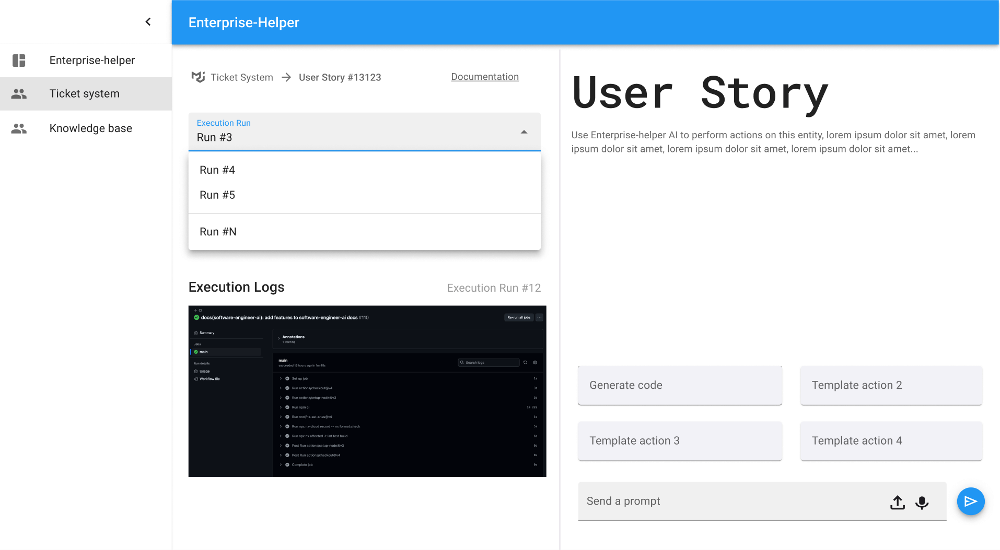
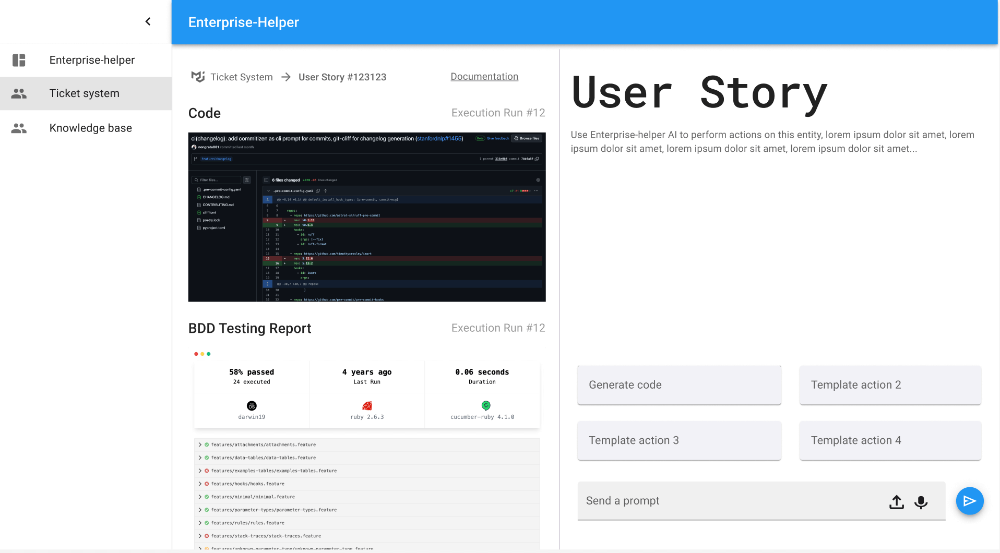

# Story

https://scaledagileframework.com/story/

## Empty Story

... (only fields that constitute the user story as a work to be done)

## Filled in non-executed Story

... (work to be done fields, filled in)

## Executed Story

work to be done with reports

---

- Story version
- Story description
- NFRs

---

- Acceptance criteria
- Definition of done

---

- Execution run
- Execution logs

---

- Code
- BDD testing report

---

- Visual regression testing report

---

- E2E testing report

---

- Unit testing report

