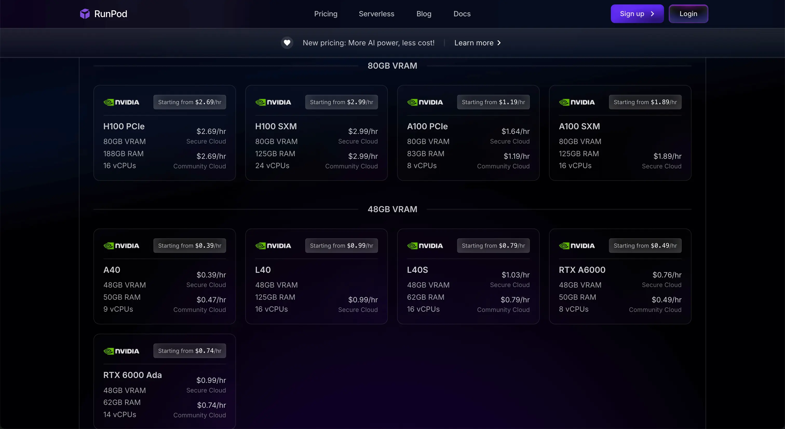
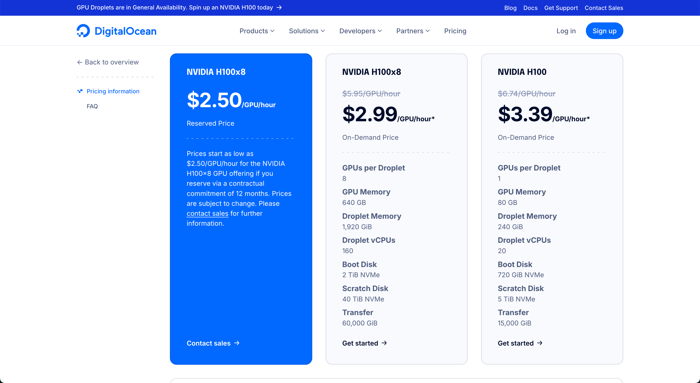

# Hardware Rent in Cloud

[Runpod](https://www.runpod.io/pricing)

[DigitalOcean](https://www.digitalocean.com/pricing/gpu-droplets)

### Calculating monthly costs

One possible way to calculate average costs for using LMs is (from [The HARD Truth About Hosting Your Own LLMs](https://www.youtube.com/watch?v=EMuBqcO048E)):

With [Runpod](https://www.runpod.io/pricing) (capable of running **Llama 3.1 70B Versatile 128k**):

For [**`A40`**](https://www.nvidia.com/en-us/data-center/a40/) ([datasheet](https://images.nvidia.com/content/Solutions/data-center/a40/nvidia-a40-datasheet.pdf)) (48GB VRAM, 50GB RAM, 9 vCPUs):

`$0.39/hr` * `24 (hours in a day)` * `30 (days in a month)` = **`280.8 $ / month`**