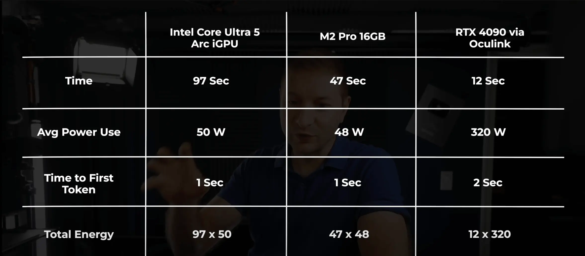
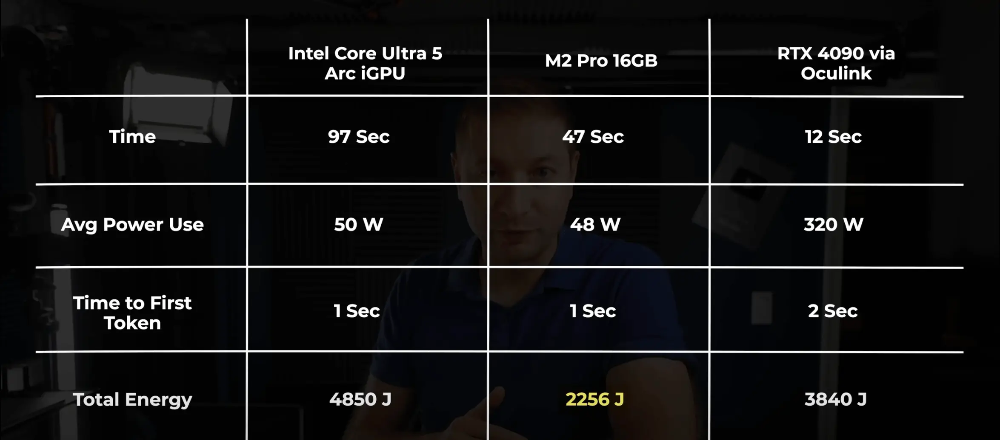

# Local Hardware Costs

- Different hardware can imply different operation cost for the same value.
- For example, choice to run a LM locally **on an external graphic card** can incur big expenses, as shown in [The HARD Truth About Hosting Your Own LLMs](https://www.youtube.com/watch?v=EMuBqcO048E)
    - high cost of the graphic card itself
    - high cost of the electricity it consumes (imply it running 24/7 by default)

---

From [Local LLM Challenge | Speed vs Efficiency](https://www.youtube.com/watch?v=0EInsMyH87Q)

## Energy consumption

...

## Heat

...

## Noise

...

Example: [Which is louder: Intel i9 MacBook Pro, M2 Max MacBook Pro, or M3 Max MacBook Pro?](https://www.youtube.com/shorts/ztUTXS5QPHo)

## Required cooling

## Cost

...