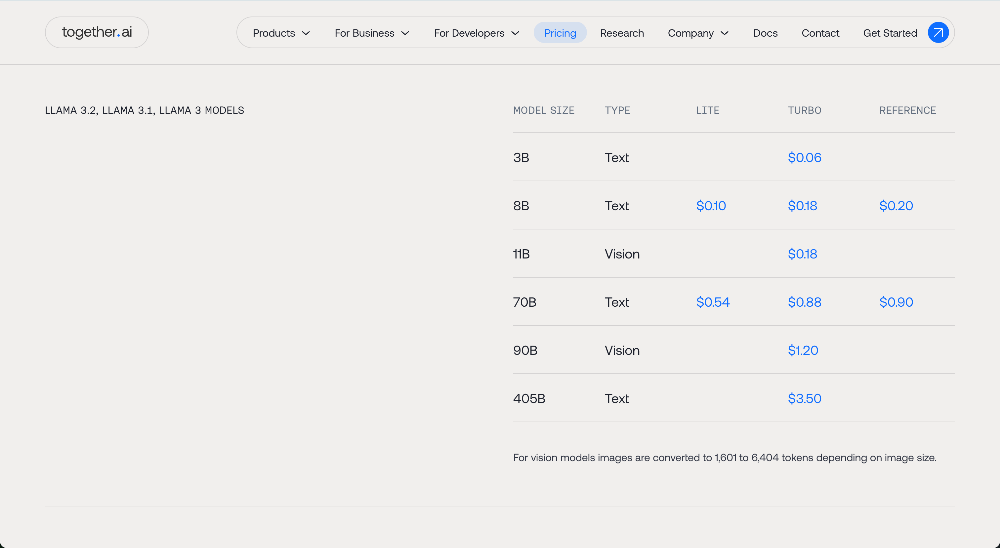

# Tokens as a Service

like [Groq](https://groq.com/pricing/), with `On-demand Pricing for Tokens-as-a-Service`

or [together.ai](https://www.together.ai/pricing)

### Calculating monthly costs

One possible way to calculate average costs for using LMs is (from [The HARD Truth About Hosting Your Own LLMs](https://www.youtube.com/watch?v=EMuBqcO048E)):

With [Groq](https://groq.com/pricing/):

For **Llama 3.1 70B Versatile 128k**

`1 690 000 (Tokens / 1$)` / `5000 (average tokens per prompt)` = **`338 (prompts / 1$)`**

`338 (prompts / 1$)` * `280.8 ($ / month)` = **`94 910,4 (prompts / month)`**

`94 910,4 (prompts / month)` / `30 (days in a month)` = `3 163 (prompts / day)`

> So, for **280$** per month you'd get **3 163 per day**, which is not that much. If you have 3000 active users per day, they can make **each one prompt**, and then it is already worth of switching to hosting your own LLM.
