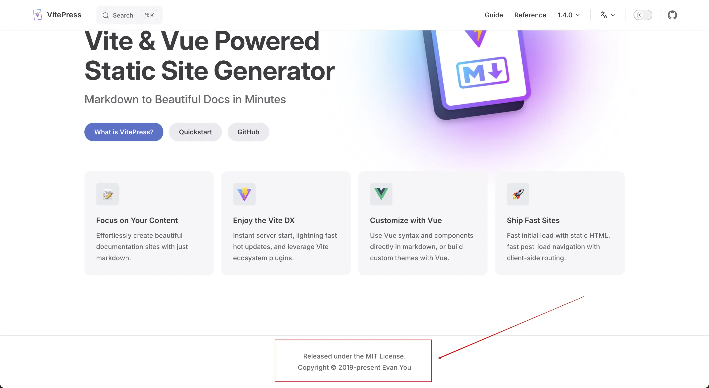

# License

## MIT License. Forever.

Long story told short: [TerraForm case & OpenTofu](https://opentofu.org/manifesto/)

## Github Open Source Legal Guide

- [Github] Open Source Guide. Legal: [Which open source license is appropriate for my project?](https://opensource.guide/legal/#which-open-source-license-is-appropriate-for-my-project)

---

## Other

- [choosealicense.com](https://github.com/github/choosealicense.com)
    - A site to provide non-judgmental guidance on choosing a license for your open source project

---

- [ ] Consider releasing Enterprise-helper under [MIT license](https://www.youtube.com/watch?v=1m4RRnu7sY4) as in [vitepress.dev](https://vitepress.dev/).
    - just for knowledge:
        - [Free and Open Source software licenses explained](https://www.youtube.com/watch?v=UMIG4KnM8xw)
        - [Software Licensing and Why You NEED to be Careful](https://www.youtube.com/watch?v=0fK2aFSYauw)

- [ ] Consider personal copyright as in [vitepress.dev](https://vitepress.dev/)

