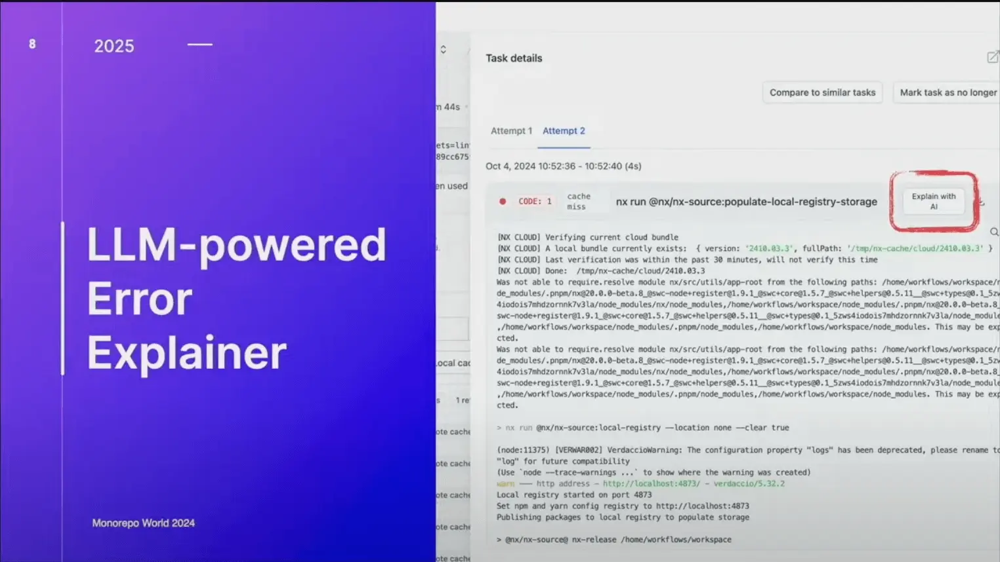
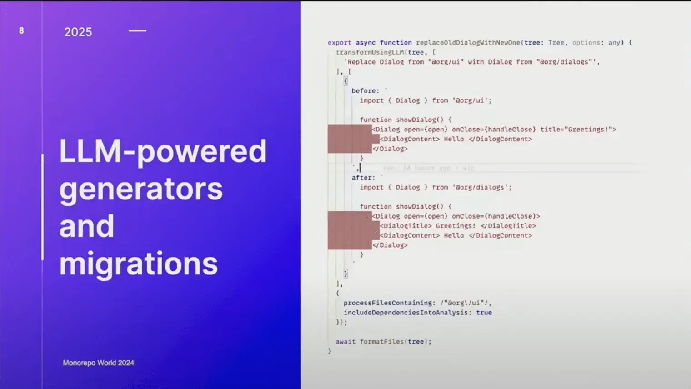
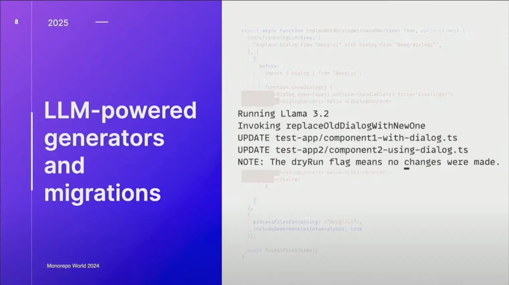

# LLM-empowered features

Any product is as much viable, as it is AI-native or AI-enabled. Any **process** / **feature** involved in the entire chain of products developed and delivered have to be re-thought from the perspective and possibility of being **LLM-empowered**.

...

> Do not confuse with nx generators of AI entities. We now have two different things in this context:
>
> - [nx LLM-powered generators and migrations](/product/product-viability#nx-llm-powered-generators--migrations)
> - [enterprise helper's nx generators of AI functionality](/product/features/nx-generators-ai-functionality)

### Examples:

#### nx LLM-powered error explainers

#### nx LLM-powered generators & migrations

