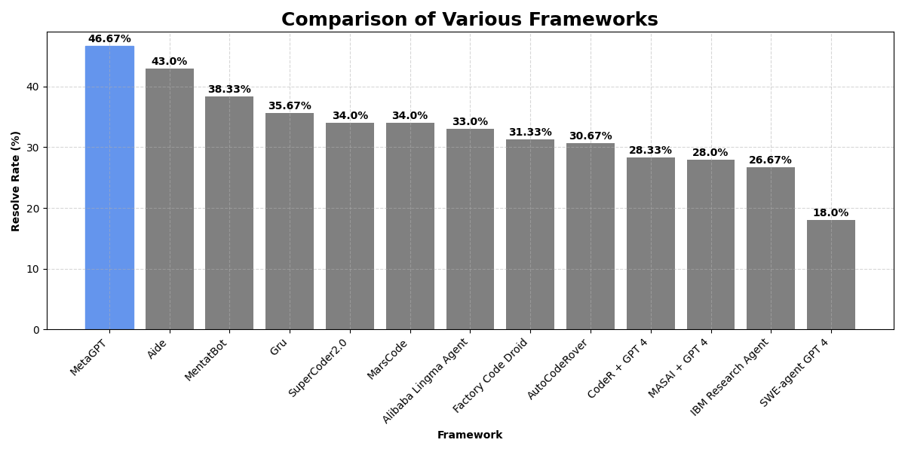

# SAFe Portal Development

- Use [crewAI](https://github.com/crewAIInc/crewAI) for agents (personas for SAFe roles) 

---

- Use [MUI Toolpad](https://mui.com/toolpad/) for
    - Navigation
    - Layout
    - Authentication
    - Page container

---

- Use [RAG with Vercel AI SDK](https://vercel.com/templates/next.js/ai-sdk-rag) as an example for
    - Information retrieval and addition through tool calls (using the streamText function)
    - Real-time streaming of model responses to the frontend (using the useChat hook)
    - Vector embedding storage with DrizzleORM and PostgreSQL

---

- Study [Vercel AI SDK](https://sdk.vercel.ai/docs/introduction) for possible implementation
    - [AI SDK Core](https://sdk.vercel.ai/docs/ai-sdk-core): A unified API for generating text, structured objects, and tool calls with LLMs.
    - [AI SDK UI](https://sdk.vercel.ai/docs/ai-sdk-ui): A set of framework-agnostic hooks for quickly building chat and generative user interface.
    - [AI SDK RSC](https://sdk.vercel.ai/docs/ai-sdk-rsc): A library to stream generative user interfaces with React Server Components (RSC).
    - [AI SDK Providers](https://sdk.vercel.ai/providers/ai-sdk-providers#provider-support) (multiple models)
        - [Groq](https://sdk.vercel.ai/providers/ai-sdk-providers/groq#model-capabilities)

- Consider [Vercel's templates](https://vercel.com/templates)
    - [For AI](https://vercel.com/templates?type=ai)
        - [Next.js AI Chatbot](https://vercel.com/templates/next.js/nextjs-ai-chatbot) (for chatting with personas?)
        - [Dynamic Model Usage with AI SDK](https://vercel.com/templates/next.js/ai-sdk-feature-flags-edge-config) (for manual switching between different models? what about MoA?)
    - By usecase
    - By database
    - By authentication
    - By analytics
---

What about these tools? Should I consider those? Or at least study more to explore?
