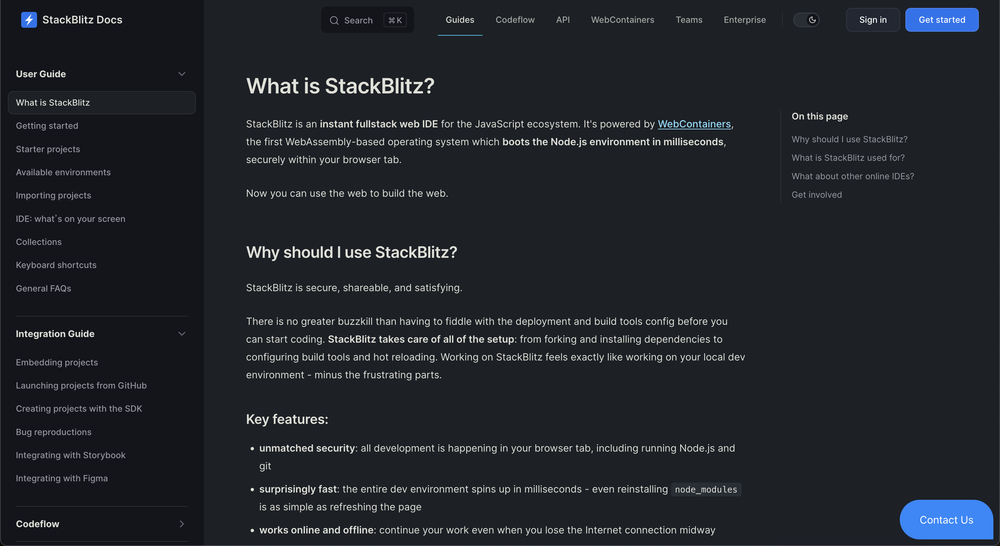
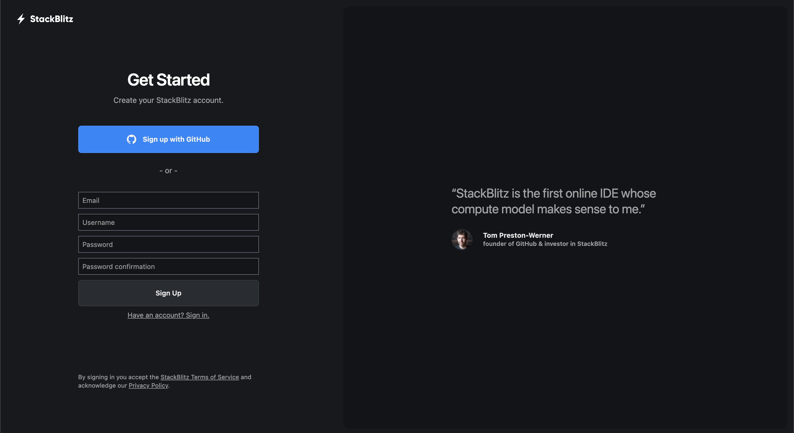
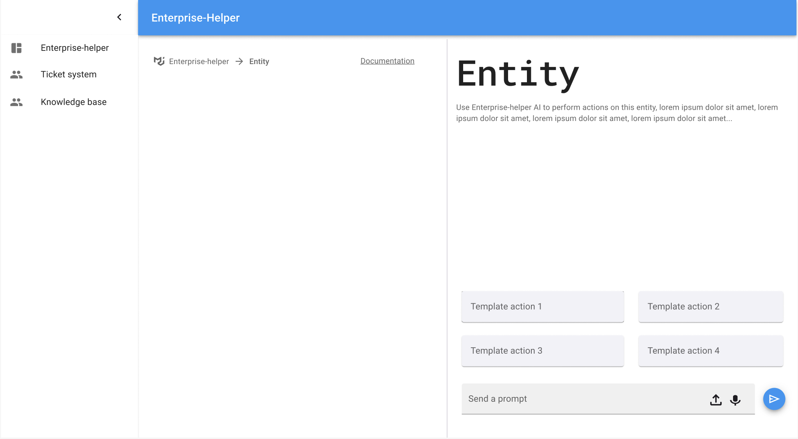
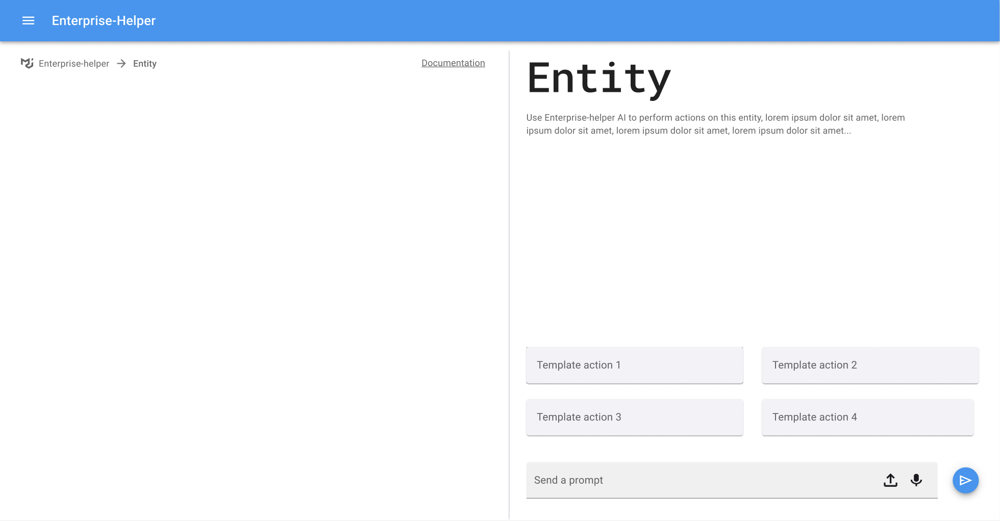

# User Interface

## Design kit

- [Material UI for Figma (and MUI X)](https://www.figma.com/community/file/912837788133317724)
    - [docs](https://mui.com/material-ui/design-resources/material-ui-for-figma/)

## UI Prototypes

1. Open UI-kit [MUI for Figma](https://www.figma.com/design/bJ29Pjw22O6wPkWm26oKHN/Material-UI-for-Figma-(and-MUI-X)-(Community))

2. Open UI-prototype [Figma: Enterprise-helper](https://www.figma.com/design/zgdghcttSHdMVsGZJ6I7zO/Enterprise-helper?node-id=0-1&t=oWjDYtw5fRjsHmev-1)

https://mui.com/toolpad/ ?

https://mui.com/toolpad/core/react-dashboard-layout/ ?

## User Interface

### Step 1. Docs
- [ ] add "Get Started" button

### Step 2. Sign-in

### Step 3. App

...

- [collapsible] drawer
- main page area
- [collapsible] chat area

### Enterprise-helper Workflow

App usage workflow (for empty page with entities, e.g. strategic themes) (can be general approach for all such pages):

0. Page with empty templates for entities (e.g. strategic themes, portfolio Canvas, user story, etc.)
1. Detect which entities are on the current screen
2. In the chat area have buttons to perform actions on entities (generate an entity, suggest to add the generated entity into the actual list (main page area) of entities, apply button, cancel button)

---

### Software engineer AI

